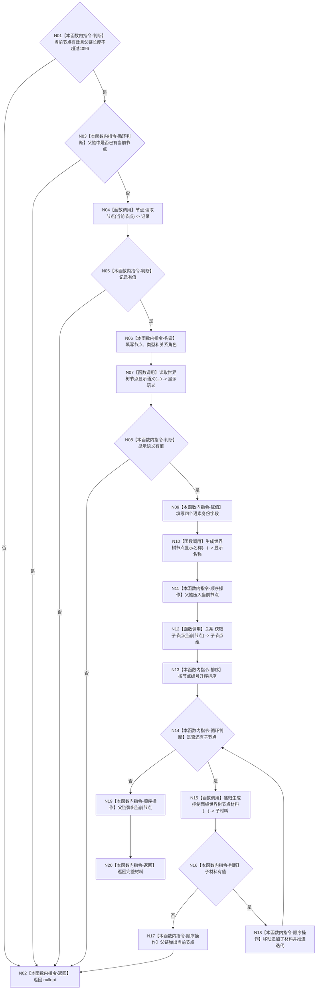

# ENTRY-ONLY F22 生成控制面板世界树节点材料施工流程图

更新时间：2026-07-26

## 依据

```text
规范/8120_子规范_程序入口启动模式与运行宿主边界_20260726.md
海中鱼巣/入口.cpp:178-234 @ cf3e12d2d57192ca0d99b3acbc6f7d3f3fa7dc43
```

## 身份与边界

施工流程图；递归仅形成只读树材料，环和深度异常逻辑内返回空材料。

## 函数合同

```text
根函数：生成控制面板世界树节点材料
归属模块 / 文件 / 层级：海中鱼巣.界面.投影.控制面板启动 / 海中鱼巣/界面/投影.控制面板启动.ixx / 私有
现有或待新增：从入口匿名命名空间迁移
完整签名：std::optional<控制面板树节点材料> 生成控制面板世界树节点材料(const 节点仓库& 节点, const 关系仓库& 关系, 节点句柄 当前节点, const 世界树初始化结果& 初始化结果, const 语素初始化结果& 语素初始化读数, const std::optional<世界树相对坐标>& 自我相对坐标, std::vector<节点句柄>& 当前父链)
参数：仓库和初始化材料只读借用；当前节点按值；父链由本次递归独占可写并在每条返回路径恢复
返回结果：完整节点树材料，或逻辑内 nullopt；零业务写入
被调函数流程图：F20、F21、F22 递归回边
```

## 流程图



## 节点合同

| 节点 | 类型 | 参数 / 输入绑定 | 结果 / 输出绑定 | 事实读写 | 后继条件 | 验证 |
| --- | --- | --- | --- | --- | --- | --- |
| N01/N03/N05/N08/N14/N16 | 本函数内指令 | 当前节点、父链、局部结果 | 分支 | 只读 | 按标注 | F22-V01~V05 |
| N02 | 本函数内指令 | 任一拒绝分支 | nullopt | 业务结构零写入；父链已恢复 | 终止 | F22-V02~V05 |
| N04 | 函数调用 | 当前节点 | 节点记录副本 | 只读节点仓库 | 完成 | F22-V01 |
| N06/N09/N11/N13/N17/N18/N19 | 本函数内指令 | 局部材料/父链/子组 | 更新局部投影 | 仅局部材料和父链 | 继续 | F22-V01/F22-V04 |
| N07 | 函数调用 | 当前节点、记录类型、初始化材料 | optional 显示语义 | 只读 | 完成 | F20 |
| N10 | 函数调用 | 节点、显示语义、可选坐标 | 人读名称 | 无机器写入 | 完成 | F21 |
| N12 | 函数调用 | 当前节点 | 子句柄组 | 只读关系仓库 | 完成 | F22-V01 |
| N15 | 函数调用 | 同一仓库和初始化材料、子节点、当前父链 | optional 子材料 | 递归回边；业务结构零写入 | 完成 | F22-V03/F22-V04 |
| N20 | 本函数内指令 | 完整局部材料 | optional 有值 | 无 | 终止 | F22-V01 |

## 关键边界

F22 递归只建回边，不生成第二函数身份；任何子节点失败都恢复父链并使整棵投影失败，不返回可读半树。
