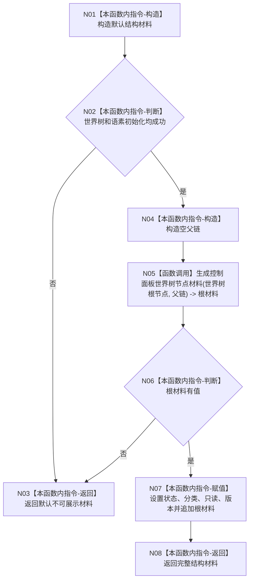

# ENTRY-ONLY F23 生成控制面板世界树结构材料施工流程图

更新时间：2026-07-26

## 依据

```text
规范/8120_子规范_程序入口启动模式与运行宿主边界_20260726.md
海中鱼巣/入口.cpp:236-259 @ cf3e12d2d57192ca0d99b3acbc6f7d3f3fa7dc43
```

## 身份与边界

施工流程图；封装完整世界树只读投影。

## 函数合同

```text
根函数：生成控制面板世界树结构材料
归属模块 / 文件 / 层级：海中鱼巣.界面.投影.控制面板启动 / 海中鱼巣/界面/投影.控制面板启动.ixx / 私有
现有或待新增：从入口匿名命名空间迁移
完整签名：控制面板树结构材料 生成控制面板世界树结构材料(const 节点仓库& 节点, const 关系仓库& 关系, const 世界树初始化结果& 初始化结果, const 语素初始化结果& 语素初始化读数, const std::optional<世界树相对坐标>& 自我相对坐标)
参数：全部借用只读且调用期间有效
返回结果：可展示且只读的完整世界树材料；失败时返回默认不可展示材料
被调函数流程图：F22
```

## 流程图



## 节点合同

| 节点 | 类型 | 参数 / 输入绑定 | 结果 / 输出绑定 | 事实读写 | 后继条件 | 验证 |
| --- | --- | --- | --- | --- | --- | --- |
| N01/N04/N07 | 本函数内指令 | 输入材料/局部值 | 局部结构材料 | 无机器写入 | 继续 | F23-V01 |
| N02/N06 | 本函数内指令 | 初始化或根材料 | 分支 | 只读 | 按图 | F23-V01/V02 |
| N03 | 本函数内指令 | 失败分支 | 默认材料 | 无 | 终止 | F23-V02 |
| N05 | 函数调用 | 仓库、根句柄、初始化结果、坐标、父链 | optional 根材料 | 只读 | 完成 | F22 |
| N08 | 本函数内指令 | 完整材料 | 控制面板树结构材料 | 无 | 终止 | F23-V01 |

## 关键边界

默认材料是明确不可展示的逻辑内结果，不得被控制面板或 F09 当作成功。
