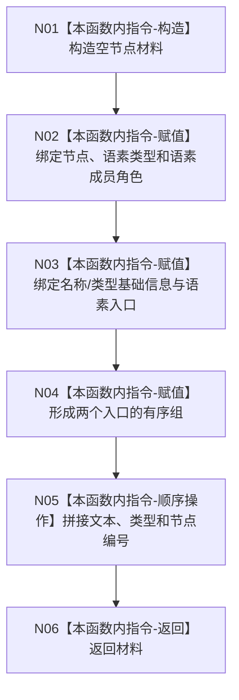

# ENTRY-ONLY F24 生成语素树显示节点材料施工流程图

更新时间：2026-07-26

## 依据

```text
规范/8120_子规范_程序入口启动模式与运行宿主边界_20260726.md
海中鱼巣/入口.cpp:261-279 @ cf3e12d2d57192ca0d99b3acbc6f7d3f3fa7dc43
```

## 身份与边界

施工流程图；只构造一个语素显示节点。

## 函数合同

```text
根函数：生成语素树显示节点材料
归属模块 / 文件 / 层级：海中鱼巣.界面.投影.控制面板启动 / 海中鱼巣/界面/投影.控制面板启动.ixx / 私有
现有或待新增：从入口匿名命名空间迁移
完整签名：控制面板树节点材料 生成语素树显示节点材料(const 语素初始化显示项& 显示项, const 语素初始化显示项& 类型项)
参数：两个显示项均为调用期间有效的只读借用
返回结果：完整局部显示材料；调用者保证两项成功
被调函数流程图：无；标准库转文本是外部边界
```

## 流程图



## 节点合同

| 节点 | 类型 | 参数 / 输入绑定 | 结果 / 输出绑定 | 事实读写 | 后继条件 | 验证 |
| --- | --- | --- | --- | --- | --- | --- |
| N01-N05 | 本函数内指令 | 显示项、类型项 | 局部节点材料逐字段完成 | 无机器写入 | 顺序执行 | F24-V01 字段全等 |
| N06 | 本函数内指令 | 完整材料 | 控制面板树节点材料 | 无 | 终止 | F24-V01 |

## 关键边界

本函数不重新读取仓库，也不判断机器事实；无效输入由 F26 在调用前拒绝。
