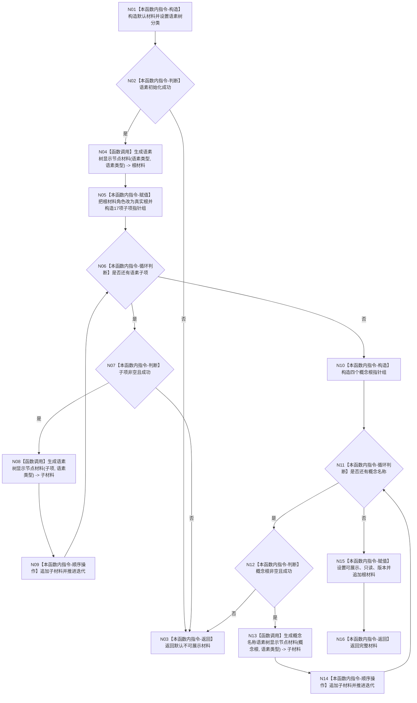

# ENTRY-ONLY F26 生成控制面板语素树结构材料施工流程图

更新时间：2026-07-26

## 依据

```text
规范/8120_子规范_程序入口启动模式与运行宿主边界_20260726.md
海中鱼巣/入口.cpp:300-356 @ cf3e12d2d57192ca0d99b3acbc6f7d3f3fa7dc43
```

## 身份与边界

施工流程图；形成完整语素树投影，任一子项无效时返回不可展示默认材料。

## 函数合同

```text
根函数：生成控制面板语素树结构材料
归属模块 / 文件 / 层级：海中鱼巣.界面.投影.控制面板启动 / 海中鱼巣/界面/投影.控制面板启动.ixx / 私有
现有或待新增：从入口匿名命名空间迁移
完整签名：控制面板树结构材料 生成控制面板语素树结构材料(const 语素初始化结果& 语素初始化读数, const 概念图初始化结果& 概念图初始化读数)
参数：两个初始化结果均为只读借用
返回结果：完整可展示只读语素树；失败时默认不可展示材料
被调函数流程图：F24、F25
```

## 流程图



## 节点合同

| 节点 | 类型 | 参数 / 输入绑定 | 结果 / 输出绑定 | 事实读写 | 后继条件 | 验证 |
| --- | --- | --- | --- | --- | --- | --- |
| N01/N05/N09/N10/N14/N15 | 本函数内指令 | 初始化结果和局部材料 | 局部结构更新 | 无机器写入 | 顺序执行 | F26-V01 |
| N02/N06/N07/N11/N12 | 本函数内指令 | 当前初始化项或迭代状态 | 分支 | 只读 | 按图 | F26-V01/V02 |
| N03 | 本函数内指令 | 任一无效分支 | 默认材料 | 无半树发布 | 终止 | F26-V02 |
| N04/N08 | 函数调用 | 语素显示项、语素类型 | 节点材料 | 无机器写入 | 完成 | F24 |
| N13 | 函数调用 | 概念根、语素类型 | 节点材料 | 无机器写入 | 完成 | F25 |
| N16 | 本函数内指令 | 完整材料 | 控制面板树结构材料 | 无 | 终止 | F26-V01 |

## 关键边界

17 个既有语素显示项和 4 个概念名称缺一即整体不可展示；不得返回部分子树冒充成功。
