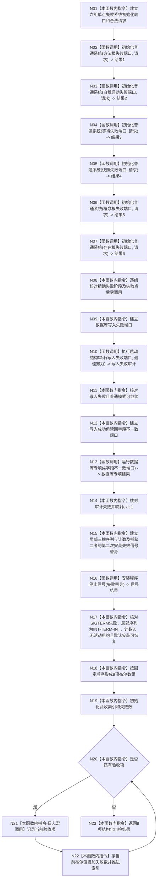

# ENTRY-ONLY F27 运行入口端口合同自检

更新时间：2026-07-26

## 依据

```text
规范/8120_子规范_程序入口启动模式与运行宿主边界_20260726.md
规范/详细设计/20260726_ENTRY-ONLY_入口职责单一化详细设计_v0.3.md
计划/20260726_ENTRY-ONLY_薄入口模式路由与初始化宿主分层代码实施计划_v0.3.md
```

## 函数合同

图类型：施工流程图
完整签名：`自检单元结果 运行入口端口合同自检()`
归属：`海中鱼巣/启动.应用程序.ixx`。参数：无。返回：编号 `ENTRY-ONLY-PORT-CONTRACT`、9 项验收及失败数量。
允许：仅在函数局部建立系统初始化、数据库审计和信号安装替身；禁止修改中央运行器、生产仓库或日志裁决。被调图：F08、F10、F11、F12。验证：V10/V14/V16/V19/V26-V29。

## 流程图



## 节点合同

| 节点 | 类型 | 实现分析 |
| --- | --- | --- |
| N01/N08-N09/N11-N12/N14-N15/N17-N20/N22-N23 | 本函数内指令 | 每个节点只建立一组替身、核对一个合同阶段或执行一个数组/循环动作。N15 的三槽序列、计数和捕获型 `std::function` 全部是 F27 自动存储期局部对象；禁止模块、static、global 或 `thread_local` 证据。 |
| N02-N07 | 函数调用 | 六次分别调用 F08；每次只有一个具名失败点，结果和后继调用计数分别绑定。 |
| N10 | 函数调用 | 调用 F10，验证最佳努力审计失败不等于普通宿主失败。 |
| N13 | 函数调用 | 把字段不一致端口指针注入 F11，直接验证数据库专项严格映射。 |
| N16 | 函数调用 | 调用 F12；捕获型替身第一次 SIGINT 返回 `SIG_DFL`、第二次 SIGTERM 返回 `SIG_ERR`，F12 第三次调用同一替身恢复 SIGINT；返回后局部序列可机械读取。 |
| N21 | 本函数内指令 | 只调用可关闭调试日志宏；宏关闭不求值日志专用参数，结果不参与 N22。 |

## 关键边界

宏不得控制九项验收求值；日志参数在宏关闭时不得求值。F27 不调用中央运行器合同自检。引用捕获替身只允许走第二次安装失败路径，F12 返回前完成恢复并销毁端口副本；不得形成借用 F27 局部对象的成功租约。
