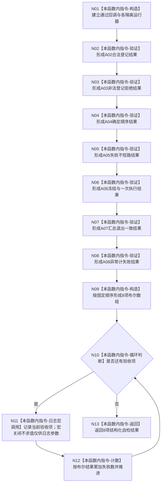

# ENTRY-ONLY F27 运行自检运行器合同自检施工流程图

更新时间：2026-07-26

## 依据

```text
规范/8120_子规范_程序入口启动模式与运行宿主边界_20260726.md
海中鱼巣/自检.运行器.ixx:245-334 @ cf3e12d2d57192ca0d99b3acbc6f7d3f3fa7dc43
```

## 身份与边界

施工流程图；保留既有 A02-A08 机器验证，只把每项人读展示从 stdout 改为可关闭统一日志宏。

## 函数合同

```text
根函数：运行自检运行器合同自检
归属模块 / 文件 / 层级：海中鱼巣.自检.运行器 / 海中鱼巣/自检.运行器.ixx / 导出自检函数
现有或待新增：现有函数，仅修改人读输出边界
完整签名：自检单元结果 运行自检运行器合同自检()
参数：无
返回结果：编号 SELFTEST-RUNNER、8 项验收及失败数量的自检单元结果
被调函数流程图：既有自检运行器公开合同保持不变；本计划不修改其算法
```

## 流程图



## 节点合同

| 节点 | 类型 | 参数 / 输入绑定 | 结果 / 输出绑定 | 事实读写 | 后继条件 | 验证 |
| --- | --- | --- | --- | --- | --- | --- |
| N01-N09 | 本函数内指令 | 局部运行器、回调和结果 | A02-A08 与固定数组 | 只写隔离测试局部状态 | 顺序执行 | 既有 SELFTEST-RUNNER A02-A08 |
| N10/N12 | 本函数内指令 | 验收数组和索引 | 循环/失败数 | 局部计数 | 遍历8项 | 宏开关均为8项 |
| N11 | 本函数内指令 | 编号、名称、布尔结果 | 可选人读日志 | 日志非机器事实 | 无论写入结果都继续 | 宏关闭参数零求值哨兵 |
| N13 | 本函数内指令 | 失败数 | 自检单元结果 | 无业务写入 | 终止 | 结构化结果宏开关一致 |

## 关键边界

日志宏不得包围或控制 A02-A08 的求值；本计划不改变登记、排序、失败不短路、冻结、异常或退出码合同。
