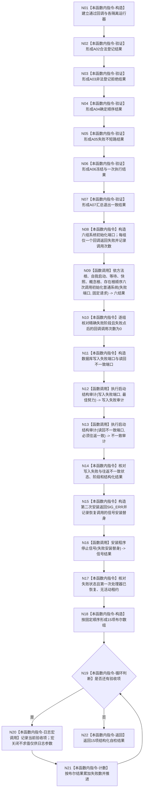

# ENTRY-ONLY F27 运行自检运行器合同自检施工流程图

更新时间：2026-07-26

## 依据

```text
规范/8120_子规范_程序入口启动模式与运行宿主边界_20260726.md
海中鱼巣/自检.运行器.ixx:245-334 @ cf3e12d2d57192ca0d99b3acbc6f7d3f3fa7dc43
```

## 身份与边界

施工流程图；保留既有 A02-A08 机器验证，并用精确端口替身增加初始化、审计和信号失败合同验证；人读展示迁移为可关闭调试日志宏。

## 函数合同

```text
根函数：运行自检运行器合同自检
归属模块 / 文件 / 层级：海中鱼巣.自检.运行器 / 海中鱼巣/自检.运行器.ixx / 导出自检函数
现有或待新增：现有函数，增加 9 项 ENTRY-ONLY 端口合同验证并修改人读输出边界
完整签名：自检单元结果 运行自检运行器合同自检()
参数：无
返回结果：编号 SELFTEST-RUNNER-S1、15 项验收及失败数量的自检单元结果
被调函数流程图：F08、F10、F12；既有自检运行器公开合同保持不变
```

## 流程图



## 节点合同

| 节点 | 类型 | 参数 / 输入绑定 | 结果 / 输出绑定 | 事实读写 | 后继条件 | 验证 |
| --- | --- | --- | --- | --- | --- | --- |
| N01-N07 | 本函数内指令 | 局部运行器、回调和结果 | A02-A07 | 只写隔离测试局部状态 | 顺序执行 | 既有 SELFTEST-RUNNER-S1 A02-A07 |
| N08 | 本函数内指令 | 六个完整 `系统初始化端口`；第 k 组仅第 k 回调失败 | 六组调用计数与固定请求 | 只写替身局部状态 | N09 | V10 |
| N09 | 函数调用 | 六组失败端口、同一合法 `系统初始化请求` | 六个 `系统初始化结果` | 仅写各组隔离替身 | N10 | V10 |
| N10 | 本函数内指令 | 六结果、六组调用计数 | 6 项 bool | 无 | N11 | V10 |
| N11 | 本函数内指令 | 四个审计回调均具名；一组写入失败，一组写入成功但读回内容不同 | 两个 `数据库启动审计端口` | 只写替身局部状态 | N12 | V14/V16 |
| N12/N13 | 函数调用 | 对应端口；要求依次为 `最佳努力`、`必须往返一致` | 两个 `数据库启动审计结果` | 不写领域仓库 | N14 | V14/V16 |
| N14 | 本函数内指令 | 两个审计结果 | 2 项 bool | 无 | N15 | V14/V16 |
| N15 | 本函数内指令 | 第一次返回原处理器、第二次返回 `SIG_ERR`，恢复调用返回成功 | `程序信号安装函数` 替身及调用序列 | 只写替身局部状态 | N16 | V19 |
| N16 | 函数调用 | N15 替身 | `停止信号安装结果` | 只改模块私有租约再回滚 | N17 | V19 |
| N17 | 本函数内指令 | 信号结果与替身调用序列 | 1 项 bool | 无 | N18 | V19 |
| N18/N19/N21 | 本函数内指令 | A02-A07、V10 六项、V14、V16、V19 共 15 项 | 固定数组、循环、失败数 | 局部计数 | 遍历15项 | 宏开关均为15项 |
| N20 | 本函数内指令 | 编号、名称、布尔结果 | 可选调试日志 | 日志非机器事实 | 无论写入结果都继续 | V26-V28 |
| N22 | 本函数内指令 | 验收数15、失败数 | 自检单元结果 | 无业务写入 | 终止 | 结构化结果宏开关一致 |

## 关键边界

日志宏不得包围或控制 A02-A07/V10/V14/V16/V19 的求值；端口替身只能存在于本自检函数局部，生产调用必须绑定真实上下文或 `&std::signal`。
