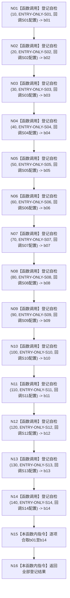

# ENTRY-ONLY F28 登记入口初始化自检单元

更新时间：2026-07-26

## 依据

```text
规范/8120_子规范_程序入口启动模式与运行宿主边界_20260726.md
规范/详细设计/20260726_ENTRY-ONLY_入口职责单一化详细设计_v0.1.md
计划/20260726_ENTRY-ONLY_薄入口模式路由与初始化宿主分层代码实施计划_v0.1.md
```

## 函数合同

图类型：施工流程图
完整签名：`bool 登记入口初始化自检单元(自检运行器& 运行器, const 入口初始化自检运行配置& 配置)`
归属：`海中鱼巣/自检.入口初始化.ixx`。参数：借用运行器、只读配置。返回：14 项是否全部登记成功。
允许：按 10..140 登记 S01-S14；禁止运行批次、登记 F27/F29 或改写配置。被调图：S01-S14；被调合同 C17。验证：V20-V22。

## 流程图



## 节点合同

| 节点 | 类型 | 实现分析 |
| --- | --- | --- |
| N01-N14 | 函数调用 | 每节点只调用一次 C17，顺序、编号、名称和唯一 S 回调固定；回调值式捕获同一只读配置。 |
| N15-N16 | 本函数内指令 | 不用隐藏循环或阶段别名；只合取十四个登记结果并返回。 |

## 关键边界

F28 不运行批次，不调用 F15，不登记自身或其它合同自检。
