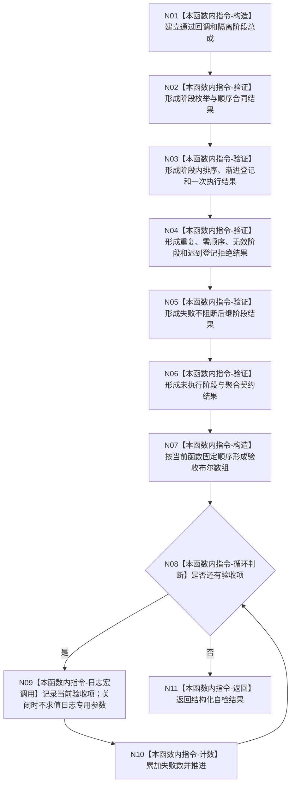

# ENTRY-ONLY F28 运行阶段化自检总成合同自检施工流程图

更新时间：2026-07-26

## 依据

```text
规范/8120_子规范_程序入口启动模式与运行宿主边界_20260726.md
海中鱼巣/自检.运行器.ixx:337-末尾对应函数 @ cf3e12d2d57192ca0d99b3acbc6f7d3f3fa7dc43
```

## 身份与边界

施工流程图；保留阶段总成既有结构化验证，只迁移人读输出。

## 函数合同

```text
根函数：运行阶段化自检总成合同自检
归属模块 / 文件 / 层级：海中鱼巣.自检.运行器 / 海中鱼巣/自检.运行器.ixx / 导出自检函数
现有或待新增：现有函数，仅修改人读输出边界
完整签名：自检单元结果 运行阶段化自检总成合同自检()
参数：无
返回结果：固定编号、固定验收数量和失败数量的自检单元结果
被调函数流程图：既有阶段化自检总成公开合同保持不变；本计划不修改其算法
```

## 流程图



## 节点合同

| 节点 | 类型 | 参数 / 输入绑定 | 结果 / 输出绑定 | 事实读写 | 后继条件 | 验证 |
| --- | --- | --- | --- | --- | --- | --- |
| N01-N07 | 本函数内指令 | 局部阶段总成、回调和批次结果 | 既有具名验收布尔组 | 只写隔离测试局部状态 | 顺序执行 | 既有阶段总成合同自检全项 |
| N08/N10 | 本函数内指令 | 固定数组、索引 | 循环和失败数 | 局部计数 | 遍历完成 | 宏开关执行数一致 |
| N09 | 本函数内指令 | 编号、名称、结果 | 可选统一日志 | 非机器事实 | 日志结果不分支 | 宏关闭零求值 |
| N11 | 本函数内指令 | 验收数、失败数 | 自检单元结果 | 无业务写入 | 终止 | 宏开关结果全等 |

## 关键边界

不得因日志关闭跳过任何阶段验证；不得用日志存在证明阶段总成合同通过。
