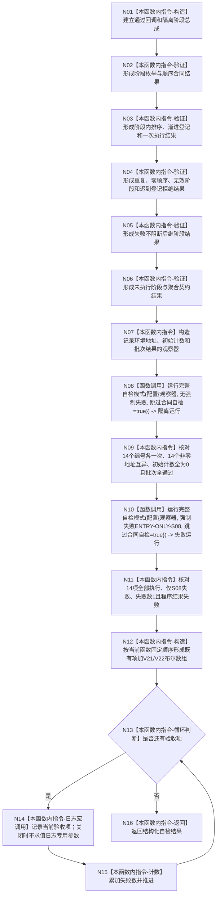

# ENTRY-ONLY F28 运行阶段化自检总成合同自检施工流程图

更新时间：2026-07-26

## 依据

```text
规范/8120_子规范_程序入口启动模式与运行宿主边界_20260726.md
海中鱼巣/自检.运行器.ixx:337-末尾对应函数 @ cf3e12d2d57192ca0d99b3acbc6f7d3f3fa7dc43
```

## 身份与边界

施工流程图；保留阶段总成既有结构化验证，增加隔离环境与失败不短路的可观察合同验证，并迁移人读输出。

## 函数合同

```text
根函数：运行阶段化自检总成合同自检
归属模块 / 文件 / 层级：海中鱼巣.自检.运行器 / 海中鱼巣/自检.运行器.ixx / 导出自检函数
现有或待新增：现有函数，增加 V21/V22 合同验证并修改人读输出边界
完整签名：自检单元结果 运行阶段化自检总成合同自检()
参数：无
返回结果：编号 `SELFTEST-RUNNER-S2`、现有 A02-A08 七项加 V21/V22 两项，共 9 项验收及失败数量的自检单元结果
被调函数流程图：F15；既有阶段化自检总成公开合同保持不变
```

## 流程图



## 节点合同

| 节点 | 类型 | 参数 / 输入绑定 | 结果 / 输出绑定 | 事实读写 | 后继条件 | 验证 |
| --- | --- | --- | --- | --- | --- | --- |
| N01-N06 | 本函数内指令 | 局部阶段总成、回调和批次结果 | 既有具名验收布尔组 | 只写隔离测试局部状态 | 顺序执行 | 既有阶段总成合同自检全项 |
| N07 | 本函数内指令 | 两个 `noexcept` 观察回调；只追加自检编号、`uintptr_t` 地址、三项初始计数与最终批次结果 | 两个观察缓冲 | 只写测试局部状态 | N08 | V21/V22 |
| N08 | 函数调用 | 无强制失败、绑定 N07 观察回调、`跳过合同自检=true` | `程序运行结果 隔离运行` | 每项只写自己的隔离环境 | N09 | V21 |
| N09 | 本函数内指令 | 观察记录与批次结果 | V21 bool | 无 | N10 | V21 |
| N10 | 函数调用 | `强制失败编号="ENTRY-ONLY-S08"`、绑定观察回调、`跳过合同自检=true` | `程序运行结果 失败运行` | 每项只写自己的隔离环境 | N11 | V22 |
| N11 | 本函数内指令 | 观察到的批次编号、失败编号、失败数和程序结果 | V22 bool | 无 | N12 | V22 |
| N12/N13/N15 | 本函数内指令 | 现有 A02-A08 七项加 V21/V22 两项 | 固定 9 项数组、循环和失败数 | 局部计数 | 遍历完成 | 宏开关执行数一致 |
| N14 | 本函数内指令 | 编号、名称、结果 | 可选调试日志 | 非机器事实 | 日志结果不分支 | V26-V28 |
| N16 | 本函数内指令 | 验收数 9、失败数 | `SELFTEST-RUNNER-S2` 自检单元结果 | 无业务写入 | 终止 | 宏开关结果全等 |

## 关键边界

不得因日志关闭跳过任何阶段、V21 或 V22；观察回调只读测试证据且不得改变被观察结果。不得用日志存在证明合同通过。
