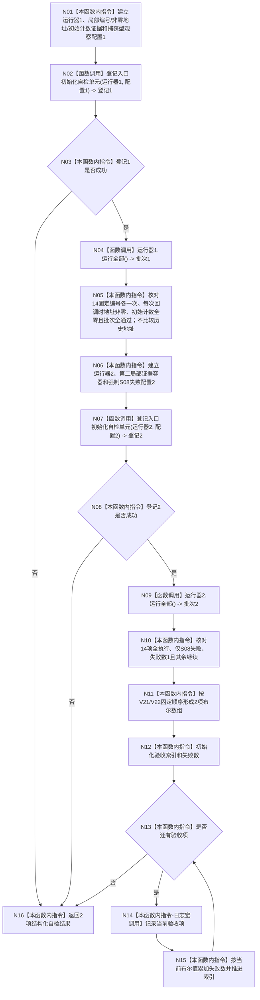

# ENTRY-ONLY F29 运行入口隔离合同自检

更新时间：2026-07-26

## 依据

```text
规范/8120_子规范_程序入口启动模式与运行宿主边界_20260726.md
规范/详细设计/20260726_ENTRY-ONLY_入口职责单一化详细设计_v0.2.md
计划/20260726_ENTRY-ONLY_薄入口模式路由与初始化宿主分层代码实施计划_v0.2.md
```

## 函数合同

图类型：施工流程图
完整签名：`自检单元结果 运行入口隔离合同自检()`
归属：`海中鱼巣/启动.应用程序.ixx`。参数：无。返回：编号 `ENTRY-ONLY-ISOLATION-CONTRACT`、2 项验收及失败数量。
允许：两个局部运行器、两个局部观察证据容器；禁止全局/thread_local 桥、调用 F15 或共享测试上下文。被调图：F28；被调合同 C12。验证：V21/V22/V26-V29。

## 流程图



## 节点合同

| 节点 | 类型 | 实现分析 |
| --- | --- | --- |
| N01/N03/N05-N06/N08/N10-N13/N15-N16 | 本函数内指令 | 两套运行器、配置、局部证据和批次互不复用；观察回调以 `std::function` 捕获对应局部状态。N05 只验证编号次数、回调期间地址非零和初始计数，不建立地址集合；无跨项共享由 F18/S01-S14 的独占构造、析构和禁止共享夹具合同共同证明。 |
| N02/N07 | 函数调用 | 分别调用 F28，只登记 S01-S14。 |
| N04/N09 | 函数调用 | 分别调用 C12；批次1应全通过，批次2应仅 S08 失败且不短路。 |
| N14 | 本函数内指令 | 只调用可关闭调试日志宏；不改变数组或失败计数。 |

## 关键边界

观察证据不是机器事实。对象析构后裸地址不再表示身份，分配器复用地址是允许行为，不得据此判定共享。F29 不调用 F15，因此不需要跳过标志，也不存在递归。
