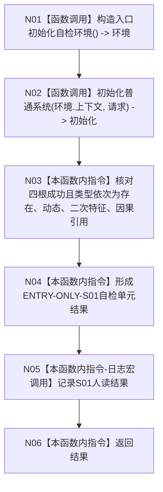

# ENTRY-ONLY S01 概念图四根创建自检

更新时间：2026-07-26

## 依据

```text
规范/8120_子规范_程序入口启动模式与运行宿主边界_20260726.md
规范/详细设计/20260726_ENTRY-ONLY_入口职责单一化详细设计_v0.1.md
计划/20260726_ENTRY-ONLY_薄入口模式路由与初始化宿主分层代码实施计划_v0.1.md
```

## 身份与边界

正式施工流程图；只在本计划允许文件内实施。

## 函数合同

以下冻结元数据中的根函数、归属、参数、返回、允许/禁止范围和执行前复核共同构成本图函数合同。

图类型：施工流程图
签名：`自检单元结果 运行概念图四根创建自检()`；归属 `海中鱼巣/自检.入口初始化.ixx`；无参数，返回 1 项结果。
绑定规范 8120、详细设计 S01、计划；只写隔离环境，禁止生产上下文/SQL/UI。结构变化随隔离环境析构消失。复核 F18/F08；验证 V20-V22、V26-V28。不得宣称普通启动已验证。

## 流程图



## 节点合同

| 节点 | 类型 | 实现分析 |
| --- | --- | --- |
| N01/N02 | 被调函数 | F18/F08；隔离生产算法。 |
| N03/N04/N06 | 指令 | 仅验证四根类型并形成 1 项 DTO。 |
| N05 | 被调函数 | 宏关闭零求值。 |

调用方 F15；被调图 F18/F08。

## 关键边界

图前冻结的允许/禁止范围、结构变化、验证和不得宣称条款均为本图关键边界。
