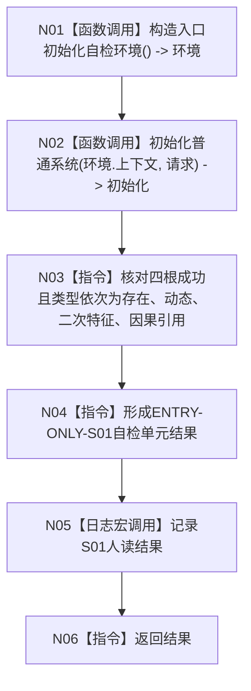

# ENTRY-ONLY S01 概念图四根创建自检

图类型：施工流程图
签名：`自检单元结果 运行概念图四根创建自检()`；归属 `海中鱼巣/自检.入口初始化.ixx`；无参数，返回 1 项结果。
绑定规范 8120、详细设计 S01、计划；只写隔离环境，禁止生产上下文/SQL/UI。结构变化随隔离环境析构消失。复核 F18/F08；验证 V20-V22、V26-V28。不得宣称普通启动已验证。

| 节点 | 类型 | 实现分析 |
| --- | --- | --- |
| N01/N02 | 被调函数 | F18/F08；隔离生产算法。 |
| N03/N04/N06 | 指令 | 仅验证四根类型并形成 1 项 DTO。 |
| N05 | 被调函数 | 宏关闭零求值。 |

调用方 F15；被调图 F18/F08。
