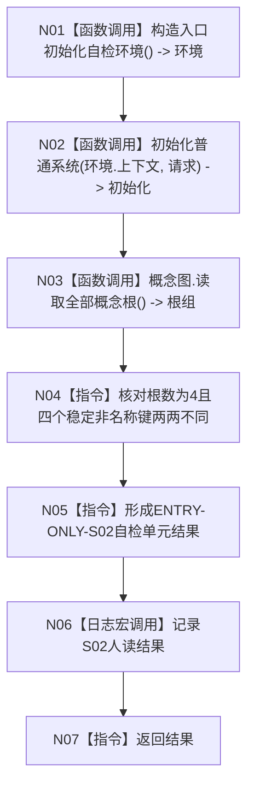

# ENTRY-ONLY S02 概念图四根唯一自检

图类型：施工流程图
签名：`自检单元结果 运行概念图四根唯一自检()`；归属自检模块；无参数，返回 1 项结果。绑定规范 8120、详细设计 S02、计划。
只写隔离环境；禁止共享上下文。验证 V20-V22/V26-V28。不得宣称普通启动已自检。

节点 N01-N03、N06 为被调函数；N04/N05/N07 为具体指令。调用方 F15；被调图 F18/F08。
