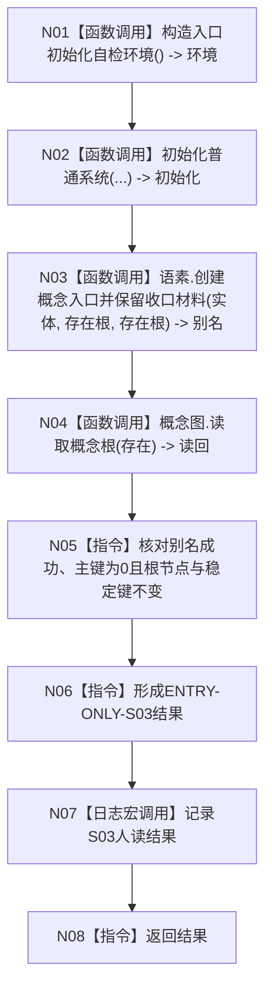

# ENTRY-ONLY S03 概念图非名称身份自检

图类型：施工流程图
签名：`自检单元结果 运行概念图非名称身份自检()`；归属自检模块；返回 1 项。绑定规范 8120、详细设计 S03、计划。
只写隔离别名材料；禁止生产上下文。验证 V20-V22/V26-V28。不得把名称当根身份。

N01-N04/N07 为被调函数；其余为具体指令。调用方 F15；被调图 F18/F08。
