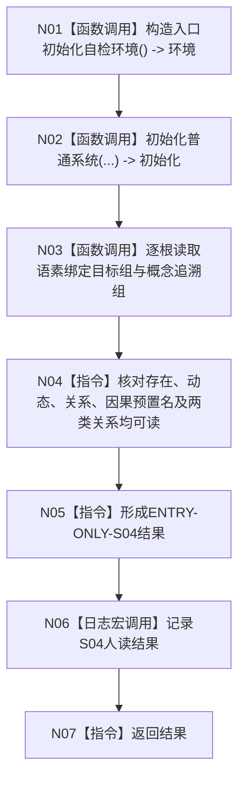

# ENTRY-ONLY S04 概念图根名绑定自检

图类型：施工流程图
签名：`自检单元结果 运行概念图根名绑定自检()`；归属自检模块；返回 1 项。绑定规范 8120、详细设计 S04、计划。
只读隔离初始化结果；禁止生产上下文写入；验证 V20-V22/V26-V28。不得把文本升级为机器事实。

N01-N03/N06 为被调函数；其余为指令。调用方 F15；被调图 F18/F08。
