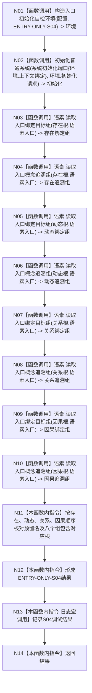

# ENTRY-ONLY S04 概念图根名绑定自检

更新时间：2026-07-26

## 依据

```text
规范/8120_子规范_程序入口启动模式与运行宿主边界_20260726.md
规范/详细设计/20260726_ENTRY-ONLY_入口职责单一化详细设计_v0.1.md
计划/20260726_ENTRY-ONLY_薄入口模式路由与初始化宿主分层代码实施计划_v0.1.md
```

## 身份与边界

正式施工流程图；只在本计划允许文件内实施。

## 函数合同

以下冻结元数据中的根函数、归属、参数、返回、允许/禁止范围和执行前复核共同构成本图函数合同。

图类型：施工流程图
签名：`自检单元结果 运行概念图根名绑定自检(const 入口初始化自检运行配置& 配置)`；归属自检模块；返回 1 项。绑定规范 8120、详细设计 S04、计划。
只读隔离初始化结果；禁止生产上下文写入；验证 V20-V22/V26-V28。不得把文本升级为机器事实。

## 流程图



N01-N10 为函数调用；N11-N14 为本函数内指令。调用方 F15；被调图 F18/F08。

## 节点合同

| 节点 | 类型 | 参数 / 输入绑定 | 结果 / 输出绑定 | 事实读写 | 后继条件 | 验证 |
| --- | --- | --- | --- | --- | --- | --- |
| N01 | 函数调用 | 无参数 | `入口初始化自检环境构造结果 环境` | 构造独占隔离上下文 | 成功后 N02；失败材料参与 N12 | V21 |
| N02 | 函数调用 | `*环境.上下文`、`环境.初始化请求` | `系统初始化结果 初始化` | 只写该隔离上下文 | N03 | V20-V22 |
| N03/N05/N07/N09 | 函数调用 | 依次绑定存在、动态、关系、因果根的 `名称语素入口.语素入口` | 四个 `std::vector<节点句柄> 绑定组` | 只读关系 4 | 按节点号顺序进入下一调用 | V20 |
| N04/N06/N08/N10 | 函数调用 | 与前一节点相同的四个语素入口 | 四个 `std::vector<节点句柄> 追溯组` | 只读关系 11 | 按节点号顺序进入下一调用 | V20 |
| N11 | 本函数内指令 | 四个根、四个绑定组、四个追溯组 | `bool 通过` | 不写结构 | N12 | V20 |
| N12 | 本函数内指令 | `通过`；若 `配置.强制失败编号 == "ENTRY-ONLY-S04"` 则仅把本项改为失败 | 编号 `ENTRY-ONLY-S04`、验收数 1 的 `自检单元结果` | 不写结构 | N13 | V20/V22 |
| N13 | 本函数内指令 | 仅使用已经形成的结果 | 无机器结果；调用调试日志宏 | 宏关闭零求值 | N14 | V26-V28 |
| N14 | 本函数内指令 | 结果 | 返回 `自检单元结果` | 无 | 终止 | V20 |

## 关键边界

图前冻结的允许/禁止范围、结构变化、验证和不得宣称条款均为本图关键边界。
