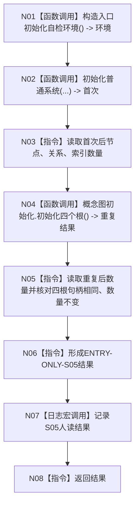

# ENTRY-ONLY S05 概念图重复初始化结构不变自检

图类型：施工流程图
签名：`自检单元结果 运行概念图重复初始化结构不变自检()`；归属自检模块；返回 1 项。绑定规范 8120、详细设计 S05、计划。
只写隔离环境；禁止普通初始化调用；验证 V20-V22/V26-V28。不得在普通初始化中重复执行。

N01/N02/N04/N07 为被调函数；其余为指令。调用方 F15；被调图 F18/F08。
