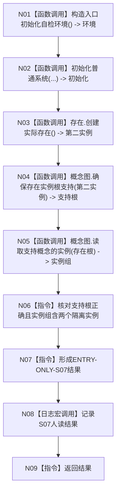

# ENTRY-ONLY S07 多存在实例根支持自检

图类型：施工流程图
签名：`自检单元结果 运行多存在实例根支持自检()`；归属自检模块；返回 1 项。绑定规范 8120、详细设计 S07、计划。
只写隔离额外实例；禁止普通启动调用；验证 V20-V22/V26-V28。不得在普通启动创建额外测试实例。

N01-N05/N08 为被调函数；其余为指令。调用方 F15；被调图 F18/F08。
