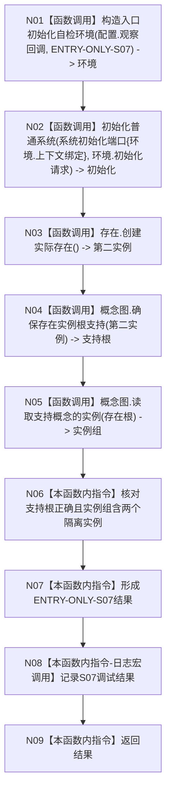

# ENTRY-ONLY S07 多存在实例根支持自检

更新时间：2026-07-26

## 依据

```text
规范/8120_子规范_程序入口启动模式与运行宿主边界_20260726.md
规范/详细设计/20260726_ENTRY-ONLY_入口职责单一化详细设计_v0.1.md
计划/20260726_ENTRY-ONLY_薄入口模式路由与初始化宿主分层代码实施计划_v0.1.md
```

## 身份与边界

正式施工流程图；只在本计划允许文件内实施。

## 函数合同

以下冻结元数据中的根函数、归属、参数、返回、允许/禁止范围和执行前复核共同构成本图函数合同。

图类型：施工流程图
签名：`自检单元结果 运行多存在实例根支持自检(const 入口初始化自检运行配置& 配置)`；归属自检模块；返回 1 项。绑定规范 8120、详细设计 S07、计划。
只写隔离额外实例；禁止普通启动调用；验证 V20-V22/V26-V28。不得在普通启动创建额外测试实例。

## 流程图



N01-N05/N08 为被调函数；其余为指令。调用方 F15；被调图 F18/F08。

## 节点合同

| 节点 | 类型 | 参数 / 输入绑定 | 结果 / 输出绑定 | 事实读写 | 后继条件 | 验证 |
| --- | --- | --- | --- | --- | --- | --- |
| N01 | 函数调用 | 无参数 | 独占 `环境` | 构造隔离上下文 | N02 | V21 |
| N02 | 函数调用 | `*环境.上下文`、固定请求 | `初始化` | 只写隔离上下文 | N03 | V20 |
| N03 | 函数调用 | 无参数调用隔离 `存在服务` | `节点句柄 第二实例` | 创建一个隔离实际存在节点 | N04 | V20 |
| N04 | 函数调用 | `第二实例` | `optional<节点句柄> 支持根` | 为第二实例建立支持关系 | N05 | V20 |
| N05 | 函数调用 | `初始化.概念图.存在根.根节点` | `vector<节点句柄> 实例组` | 只读关系 12 | N06 | V20 |
| N06 | 本函数内指令 | 支持根、实例组、自我存在节点、第二实例 | 支持根正确且实例组恰含两实例的 `bool 通过` | 无写入 | N07 | V20 |
| N07 | 本函数内指令 | `通过`；若 `配置.强制失败编号 == "ENTRY-ONLY-S07"` 则仅把本项改为失败 | `ENTRY-ONLY-S07` 结果 | 无 | N08 | V20/V22 |
| N08 | 本函数内指令 | 已形成结果 | 调试日志，无机器结果 | 宏关闭零求值 | N09 | V26-V28 |
| N09 | 本函数内指令 | 结果 | 返回 | 无 | 终止 | V20 |

## 关键边界

图前冻结的允许/禁止范围、结构变化、验证和不得宣称条款均为本图关键边界。
