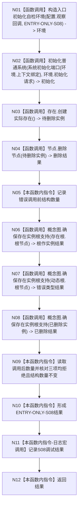

# ENTRY-ONLY S08 存在根支持拒绝自检

更新时间：2026-07-26

## 依据

```text
规范/8120_子规范_程序入口启动模式与运行宿主边界_20260726.md
规范/详细设计/20260726_ENTRY-ONLY_入口职责单一化详细设计_v0.1.md
计划/20260726_ENTRY-ONLY_薄入口模式路由与初始化宿主分层代码实施计划_v0.1.md
```

## 身份与边界

正式施工流程图；只在本计划允许文件内实施。

## 函数合同

以下冻结元数据中的根函数、归属、参数、返回、允许/禁止范围和执行前复核共同构成本图函数合同。

图类型：施工流程图
签名：`自检单元结果 运行存在根支持拒绝自检(const 入口初始化自检运行配置& 配置)`；归属自检模块；返回 1 项。绑定规范 8120、详细设计 S08、计划。
只写隔离错误样本；禁止普通启动调用；验证 V20-V22/V26-V28。不得在普通启动删除节点或执行错误输入矩阵。

## 流程图



N01-N04/N06-N08 为函数调用；其余为本函数内指令。调用方 F15；被调图 F18/F08。

## 节点合同

| 节点 | 类型 | 参数 / 输入绑定 | 结果 / 输出绑定 | 事实读写 | 后继条件 | 验证 |
| --- | --- | --- | --- | --- | --- | --- |
| N01 | 函数调用 | `配置.观察回调`、`"ENTRY-ONLY-S08"` | 独占 `环境`，并按需向观察回调发布地址与初始计数 | 构造隔离上下文 | N02 | V21 |
| N02 | 函数调用 | `*环境.上下文`、固定请求 | `初始化` | 只写隔离上下文 | N03 | V20 |
| N03 | 函数调用 | 无参数调用隔离 `存在服务` | `节点句柄 待删除实例` | 创建一个隔离实际存在 | N04 | V20 |
| N04 | 函数调用 | `待删除实例` | `bool 删除结果` | 删除隔离节点 | N05 | V20 |
| N05 | 本函数内指令 | 环境内三仓库 | 错误调用前节点/关系/索引数量 | 只读计数 | N06 | V20 |
| N06 | 函数调用 | `初始化.概念图.存在根.根节点` | `std::optional<节点句柄> 根作实例结果` | 前置拒绝，零写入 | N07 | V20 |
| N07 | 函数调用 | `初始化.概念图.动态根.根节点` | `std::optional<节点句柄> 错误类型结果` | 前置拒绝，零写入 | N08 | V20 |
| N08 | 函数调用 | `待删除实例` | `std::optional<节点句柄> 已删除结果` | 前置拒绝，零写入 | N09 | V20 |
| N09 | 本函数内指令 | 三个结果和 N05 前数量 | `bool 三拒绝且数量不变` | 读取调用后节点、关系、索引数量 | N10 | V20 |
| N10 | 本函数内指令 | N09 bool；若 `配置.强制失败编号 == "ENTRY-ONLY-S08"` 则仅把本项改为失败 | `ENTRY-ONLY-S08` 结果 | 无结构写入 | N11 | V20/V22 |
| N11 | 本函数内指令 | 已形成结果 | 无机器结果；调试宏关闭零求值 | 无 | N12 | V26-V28 |
| N12 | 本函数内指令 | 结果 | 返回 `自检单元结果` | 无 | 终止 | V20 |

## 关键边界

图前冻结的允许/禁止范围、结构变化、验证和不得宣称条款均为本图关键边界。
