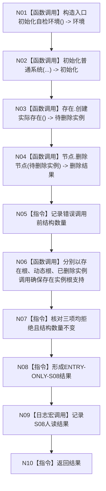

# ENTRY-ONLY S08 存在根支持拒绝自检

图类型：施工流程图
签名：`自检单元结果 运行存在根支持拒绝自检()`；归属自检模块；返回 1 项。绑定规范 8120、详细设计 S08、计划。
只写隔离错误样本；禁止普通启动调用；验证 V20-V22/V26-V28。不得在普通启动删除节点或执行错误输入矩阵。

N01-N04/N06/N09 为被调函数；其余为指令。调用方 F15；被调图 F18/F08。
