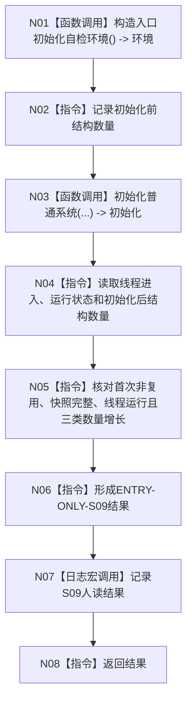

# ENTRY-ONLY S09 自我线程进入与初始化自检

图类型：施工流程图
签名：`自检单元结果 运行自我线程进入与初始化自检()`；归属自检模块；返回 1 项。绑定规范 8120、详细设计 S09、计划。
只写隔离生产初始化；禁止共享生产上下文；验证 V20-V22/V26-V28。不得用线程状态承载机器事实。

N01/N03/N07 为被调函数；其余为指令。调用方 F15；被调图 F18/F08。
