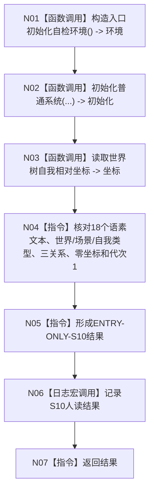

# ENTRY-ONLY S10 语素与世界树快照读回自检

图类型：施工流程图
签名：`自检单元结果 运行语素与世界树快照读回自检()`；归属自检模块；返回 1 项。绑定规范 8120、详细设计 S10、计划。
只读隔离快照；禁止生产上下文写入；验证 V20-V22/V26-V28。不得让显示文本裁决节点身份。

N01-N03/N06 为被调函数；其余为指令。调用方 F15；被调图 F18/F08。
