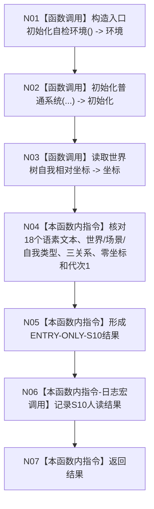

# ENTRY-ONLY S10 语素与世界树快照读回自检

更新时间：2026-07-26

## 依据

```text
规范/8120_子规范_程序入口启动模式与运行宿主边界_20260726.md
规范/详细设计/20260726_ENTRY-ONLY_入口职责单一化详细设计_v0.1.md
计划/20260726_ENTRY-ONLY_薄入口模式路由与初始化宿主分层代码实施计划_v0.1.md
```

## 身份与边界

正式施工流程图；只在本计划允许文件内实施。

## 函数合同

以下冻结元数据中的根函数、归属、参数、返回、允许/禁止范围和执行前复核共同构成本图函数合同。

图类型：施工流程图
签名：`自检单元结果 运行语素与世界树快照读回自检()`；归属自检模块；返回 1 项。绑定规范 8120、详细设计 S10、计划。
只读隔离快照；禁止生产上下文写入；验证 V20-V22/V26-V28。不得让显示文本裁决节点身份。

## 流程图



N01-N03/N06 为被调函数；其余为指令。调用方 F15；被调图 F18/F08。

## 节点合同

| 节点 | 类型 | 参数 / 输入绑定 | 结果 / 输出绑定 | 事实读写 | 后继条件 | 验证 |
| --- | --- | --- | --- | --- | --- | --- |
| N01 | 函数调用 | `N01【函数调用】构造入口初始化自检环境() -> 环境` 的实参或局部材料 | 节点文本所列返回接收或局部结果 | 仅隔离自检上下文；日志节点不写机器事实 | Mermaid 标注的下一边 | V20-V22、V26-V28 |
| N02 | 函数调用 | `N02【函数调用】初始化普通系统(...) -> 初始化` 的实参或局部材料 | 节点文本所列返回接收或局部结果 | 仅隔离自检上下文；日志节点不写机器事实 | Mermaid 标注的下一边 | V20-V22、V26-V28 |
| N03 | 函数调用 | `N03【函数调用】读取世界树自我相对坐标 -> 坐标` 的实参或局部材料 | 节点文本所列返回接收或局部结果 | 仅隔离自检上下文；日志节点不写机器事实 | Mermaid 标注的下一边 | V20-V22、V26-V28 |
| N04 | 本函数内指令 | `N04【本函数内指令】核对18个语素文本、世界/场景/自我类型、三关系、零坐标和代次1` 的实参或局部材料 | 节点文本所列返回接收或局部结果 | 仅隔离自检上下文；日志节点不写机器事实 | Mermaid 标注的下一边 | V20-V22、V26-V28 |
| N05 | 本函数内指令 | `N05【本函数内指令】形成ENTRY-ONLY-S10结果` 的实参或局部材料 | 节点文本所列返回接收或局部结果 | 仅隔离自检上下文；日志节点不写机器事实 | Mermaid 标注的下一边 | V20-V22、V26-V28 |
| N06 | 本函数内指令 | `N06【本函数内指令-日志宏调用】记录S10人读结果` 的实参或局部材料 | 节点文本所列返回接收或局部结果 | 仅隔离自检上下文；日志节点不写机器事实 | Mermaid 标注的下一边 | V20-V22、V26-V28 |
| N07 | 本函数内指令 | `N07【本函数内指令】返回结果` 的实参或局部材料 | 节点文本所列返回接收或局部结果 | 仅隔离自检上下文；日志节点不写机器事实 | Mermaid 标注的下一边 | V20-V22、V26-V28 |

## 关键边界

图前冻结的允许/禁止范围、结构变化、验证和不得宣称条款均为本图关键边界。
