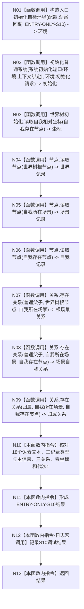

# ENTRY-ONLY S10 语素与世界树快照读回自检

更新时间：2026-07-26

## 依据

```text
规范/8120_子规范_程序入口启动模式与运行宿主边界_20260726.md
规范/详细设计/20260726_ENTRY-ONLY_入口职责单一化详细设计_v0.1.md
计划/20260726_ENTRY-ONLY_薄入口模式路由与初始化宿主分层代码实施计划_v0.1.md
```

## 身份与边界

正式施工流程图；只在本计划允许文件内实施。

## 函数合同

以下冻结元数据中的根函数、归属、参数、返回、允许/禁止范围和执行前复核共同构成本图函数合同。

图类型：施工流程图
签名：`自检单元结果 运行语素与世界树快照读回自检(const 入口初始化自检运行配置& 配置)`；归属自检模块；返回 1 项。绑定规范 8120、详细设计 S10、计划。
只读隔离快照；禁止生产上下文写入；验证 V20-V22/V26-V28。不得让显示文本裁决节点身份。

## 流程图



N01-N09 为函数调用；N10-N13 为本函数内指令。调用方 F15；被调图 F18/F08。

## 节点合同

| 节点 | 类型 | 参数 / 输入绑定 | 结果 / 输出绑定 | 事实读写 | 后继条件 | 验证 |
| --- | --- | --- | --- | --- | --- | --- |
| N01 | 函数调用 | `配置.观察回调`、`"ENTRY-ONLY-S10"` | 独占 `环境`，并按需向观察回调发布地址与初始计数 | 构造隔离上下文 | N02 | V21 |
| N02 | 函数调用 | `*环境.上下文`、固定请求 | `初始化` | 只写隔离上下文 | N03 | V20 |
| N03 | 函数调用 | 初始化快照的自我存在节点 | `optional<世界树相对坐标> 坐标` | 只读世界树初始化投影 | N04 | V20 |
| N04-N06 | 函数调用 | 依次绑定世界树根、场景、自我节点 | 三个 `optional<节点记录>` | 只读节点 | N07 | V20 |
| N07-N09 | 函数调用 | 按图中类型、起点、终点分别绑定三条关系 | 三个 `bool` | 只读关系 | N10 | V20 |
| N10 | 本函数内指令 | 语素快照、三记录、三关系、坐标、代次 | `bool 通过` | 无写入 | N11 | V20 |
| N11 | 本函数内指令 | `通过`；若 `配置.强制失败编号 == "ENTRY-ONLY-S10"` 则仅把本项改为失败 | `ENTRY-ONLY-S10` 结果 | 无 | N12 | V20/V22 |
| N12 | 本函数内指令 | 已形成结果 | 调试日志，无机器结果 | 宏关闭零求值 | N13 | V26-V28 |
| N13 | 本函数内指令 | 结果 | 返回 | 无 | 终止 | V20 |

## 关键边界

图前冻结的允许/禁止范围、结构变化、验证和不得宣称条款均为本图关键边界。
