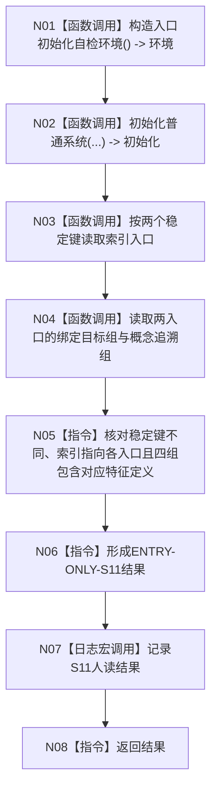

# ENTRY-ONLY S11 根需求稳定语义与特征定义自检

图类型：施工流程图
签名：`自检单元结果 运行根需求稳定语义与特征定义自检()`；归属自检模块；返回 1 项。绑定规范 8120、详细设计 S11、计划。
只读隔离索引和语素关系；禁止普通启动调用；验证 V20-V22/V26-V28。不得在普通启动重复读取验收矩阵。

N01-N04/N07 为被调函数；其余为指令。调用方 F15；被调图 F18/F08。
