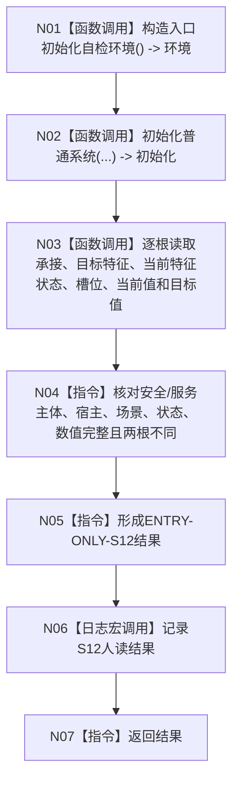

# ENTRY-ONLY S12 安全与服务根需求完整读回自检

图类型：施工流程图
签名：`自检单元结果 运行安全与服务根需求完整读回自检()`；归属自检模块；返回 1 项。绑定规范 8120、详细设计 S12、计划。
只读隔离需求结构；禁止生产上下文写入；验证 V20-V22/V26-V28。不得把普通 bool 当需求机器事实。

N01-N03/N06 为被调函数；其余为指令。调用方 F15；被调图 F18/F08。
