# ENTRY-ONLY S12 安全与服务根需求完整读回自检

更新时间：2026-07-26

## 依据

```text
规范/8120_子规范_程序入口启动模式与运行宿主边界_20260726.md
规范/详细设计/20260726_ENTRY-ONLY_入口职责单一化详细设计_v0.1.md
计划/20260726_ENTRY-ONLY_薄入口模式路由与初始化宿主分层代码实施计划_v0.1.md
```

## 身份与边界

正式施工流程图；只在本计划允许文件内实施。

## 函数合同

以下冻结元数据中的根函数、归属、参数、返回、允许/禁止范围和执行前复核共同构成本图函数合同。

图类型：施工流程图
签名：`自检单元结果 运行安全与服务根需求完整读回自检(const 入口初始化自检运行配置& 配置)`；归属自检模块；返回 1 项。绑定规范 8120、详细设计 S12、计划。
只读隔离需求结构；禁止生产上下文写入；验证 V20-V22/V26-V28。不得把普通 bool 当需求机器事实。

## 流程图

```mermaid
flowchart TD
    N01["N01【函数调用】构造入口初始化自检环境(配置.观察回调, ENTRY-ONLY-S12) -> 环境"] --> N02["N02【函数调用】初始化普通系统(系统初始化端口{环境.上下文绑定}, 环境.初始化请求) -> 初始化"]
    N02 --> N03["N03【函数调用】需求.读取需求承接材料(安全根.根需求) -> 安全承接"]
    N03 --> N04["N04【函数调用】需求.读取需求目标特征(安全根.根需求) -> 安全目标特征"]
    N04 --> N05["N05【函数调用】需求.读取需求当前特征状态材料(安全根.根需求) -> 安全当前状态"]
    N05 --> N06["N06【函数调用】特征.读取宿主特征槽位(自我存在节点, 安全根.特征定义) -> 安全槽位"]
    N06 --> N07["N07【函数调用】特征.读取I64特征值(安全槽位, 安全根.当前特征值) -> 安全当前值"]
    N07 --> N08["N08【函数调用】状态.读取状态值(安全根.目标状态) -> 安全目标值"]
    N08 --> N09["N09【函数调用】需求.读取需求承接材料(服务根.根需求) -> 服务承接"]
    N09 --> N10["N10【函数调用】需求.读取需求目标特征(服务根.根需求) -> 服务目标特征"]
    N10 --> N11["N11【函数调用】需求.读取需求当前特征状态材料(服务根.根需求) -> 服务当前状态"]
    N11 --> N12["N12【函数调用】特征.读取宿主特征槽位(自我存在节点, 服务根.特征定义) -> 服务槽位"]
    N12 --> N13["N13【函数调用】特征.读取I64特征值(服务槽位, 服务根.当前特征值) -> 服务当前值"]
    N13 --> N14["N14【函数调用】状态.读取状态值(服务根.目标状态) -> 服务目标值"]
    N14 --> N15["N15【本函数内指令】核对两根主体、宿主、场景、目标、槽位、当前值1、目标值10且根句柄不同"]
    N15 --> N16["N16【本函数内指令】形成ENTRY-ONLY-S12结果"]
    N16 --> N17["N17【本函数内指令-日志宏调用】记录S12调试结果"]
    N17 --> N18["N18【本函数内指令】返回结果"]
```



N01-N14 为函数调用；N15-N18 为本函数内指令。调用方 F15；被调图 F18/F08。

## 节点合同

| 节点 | 类型 | 参数 / 输入绑定 | 结果 / 输出绑定 | 事实读写 | 后继条件 | 验证 |
| --- | --- | --- | --- | --- | --- | --- |
| N01 | 函数调用 | `配置.观察回调`、`"ENTRY-ONLY-S12"` | 独占 `环境`，并按需向观察回调发布地址与初始计数 | 构造隔离上下文 | N02 | V21 |
| N02 | 函数调用 | `*环境.上下文`、固定请求 | `初始化` | 只写隔离上下文 | N03 | V20 |
| N03/N09 | 函数调用 | 分别绑定安全根、服务根的 `根需求` | 两份 `optional<需求承接材料>` | 只读需求承接 | 下一节点 | V20 |
| N04/N10 | 函数调用 | 分别绑定安全根、服务根的 `根需求` | 两个目标特征句柄 | 只读关系 | 下一节点 | V20 |
| N05/N11 | 函数调用 | 分别绑定安全根、服务根的 `根需求` | 两个当前特征状态句柄 | 只读关系 | 下一节点 | V20 |
| N06/N12 | 函数调用 | 自我存在节点与对应特征定义 | 两个实例特征槽位 | 只读特征槽 | 下一节点 | V20 |
| N07/N13 | 函数调用 | 对应槽位与当前特征值节点 | 两个 `optional<int64_t>` 当前值 | 只读值 | 下一节点 | V20 |
| N08/N14 | 函数调用 | 对应目标状态节点 | 两个 `optional<int64_t>` 目标值 | 只读状态值 | N15 | V20 |
| N15 | 本函数内指令 | 上述十二项和初始化快照 | `bool 通过` | 无写入 | N16 | V20 |
| N16 | 本函数内指令 | `通过`；若 `配置.强制失败编号 == "ENTRY-ONLY-S12"` 则仅把本项改为失败 | `ENTRY-ONLY-S12` 结果 | 无 | N17 | V20/V22 |
| N17 | 本函数内指令 | 已形成结果 | 调试日志，无机器结果 | 宏关闭零求值 | N18 | V26-V28 |
| N18 | 本函数内指令 | 结果 | 返回 | 无 | 终止 | V20 |

## 关键边界

图前冻结的允许/禁止范围、结构变化、验证和不得宣称条款均为本图关键边界。
