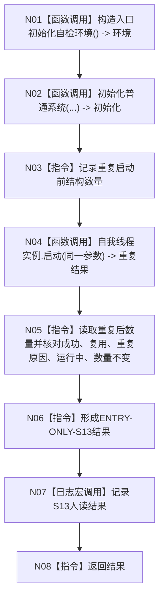

# ENTRY-ONLY S13 自我线程重复启动结构不变自检

图类型：施工流程图
签名：`自检单元结果 运行自我线程重复启动结构不变自检()`；归属自检模块；返回 1 项。绑定规范 8120、详细设计 S13、计划。
只写隔离重复调用；禁止普通启动调用；验证 V20-V22/V26-V28。不得在普通启动重复启动。

N01/N02/N04/N07 为被调函数；其余为指令。调用方 F15；被调图 F18/F08。
