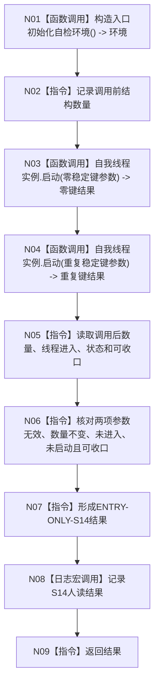

# ENTRY-ONLY S14 自我线程无效参数拒绝与生命周期自检

图类型：施工流程图
签名：`自检单元结果 运行自我线程无效参数拒绝与生命周期自检()`；归属自检模块；返回 1 项。绑定规范 8120、详细设计 S14、计划。
只写未初始化隔离环境；禁止调用 F08。验证 V20-V22/V26-V28。不得在普通启动执行错误参数。

N01/N03/N04/N08 为被调函数；其余为指令。调用方 F15；被调图 F18。
