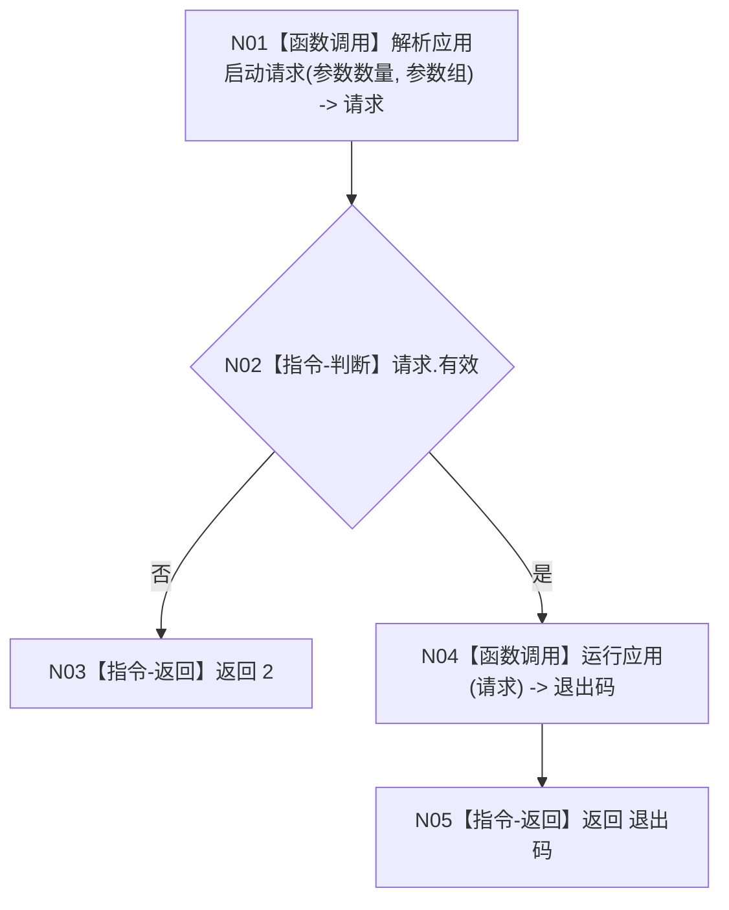

# MAIN-CLEANUP `main` 施工流程图

更新时间：2026-07-26

## 函数合同

```text
根函数：main
归属：海中鱼巣/入口.cpp / 组合层
完整签名：int main(int 参数数量, char* 参数组[])
参数：参数数量，只读；参数组，进程生命周期只读
返回：0 成功；1 运行或自检失败；2 参数或构建能力拒绝
被调图：解析应用启动请求、运行应用
```



节点 N01、N04 是函数调用；其余是本函数内判断或返回。`main` 不判断具体模式、不登记自检、不形成测试数据、不输出验收信息。
