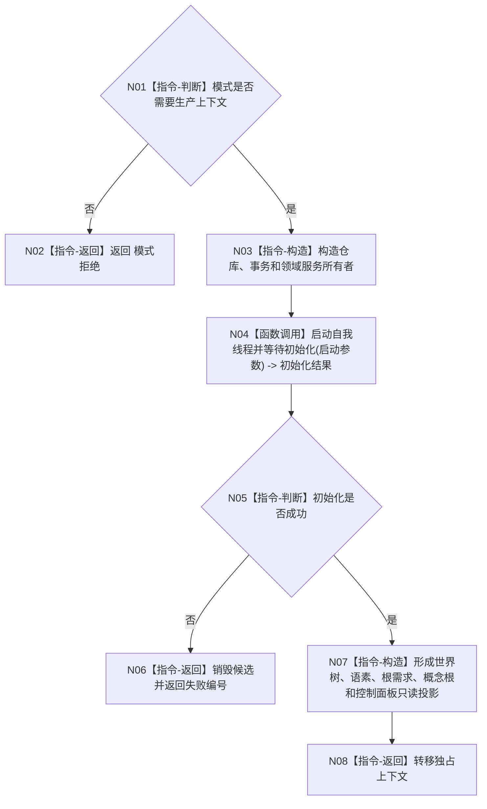

# MAIN-CLEANUP 构造生产应用上下文施工流程图

更新时间：2026-07-26

```text
根函数：构造生产应用上下文
归属：海中鱼巣/启动.应用入口.ixx
完整签名：应用上下文构造结果 构造生产应用上下文(const 应用启动请求& 请求)
参数：请求，只读，调用期有效
返回：独占应用上下文，或空上下文与失败编号
```



禁止构造测试负例、性能材料、D455 样本或数据库自检材料。
