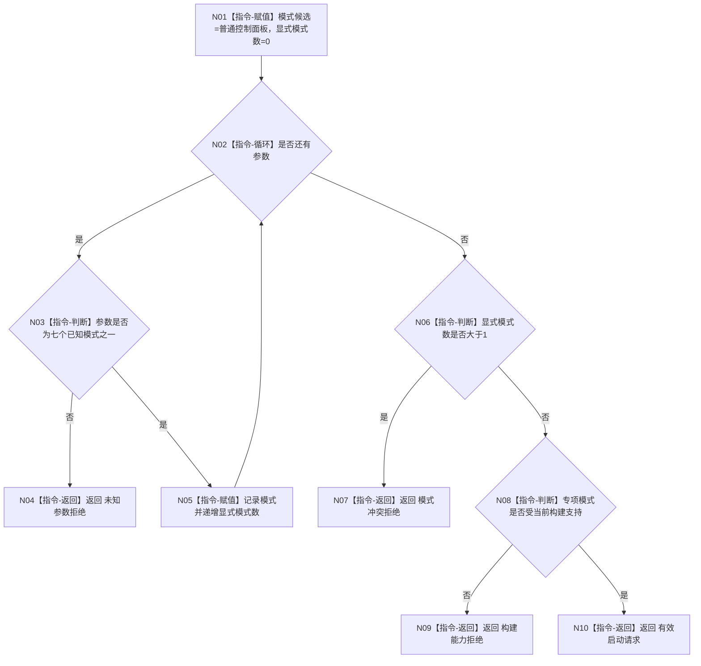

# MAIN-CLEANUP 解析应用启动请求施工流程图

更新时间：2026-07-26

```text
根函数：解析应用启动请求
归属：海中鱼巣/启动.应用入口.ixx
完整签名：应用启动请求 解析应用启动请求(int 参数数量, char* 参数组[]) noexcept
参数：参数数量，只读；参数组，进程生命周期只读
返回：唯一强类型模式，或有效=false 与拒绝原因
```



全部节点均为本函数内具体指令；解析不创建上下文、不运行自检、不写日志。
