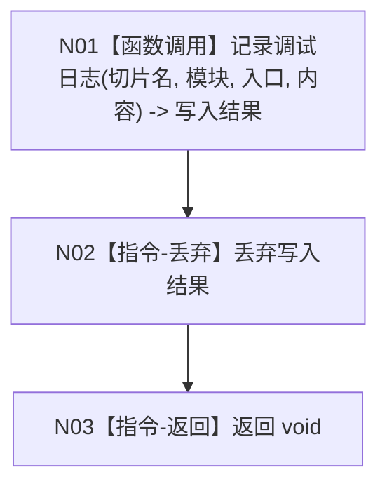

# MAIN-CLEANUP 记录自检人读报告施工流程图

更新时间：2026-07-26

```text
根函数：记录自检人读报告
归属：海中鱼巣/自检.人读日志.ixx
完整签名：void 记录自检人读报告(std::wstring_view 切片名, std::wstring_view 内容) noexcept
参数：切片名和内容均只读、调用期有效；内容由调用宏开启分支形成
返回：void；日志失败被忽略
```



本函数不查询业务结构、不改变失败计数和退出码。具名宏关闭时整个调用及内容形成表达式均不求值。
