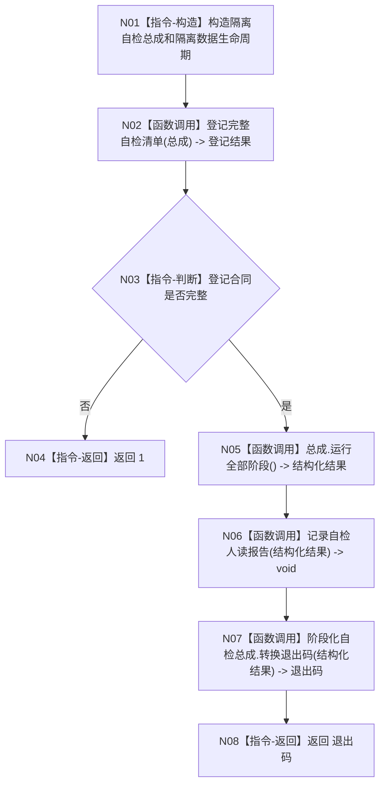

# MAIN-CLEANUP 运行完整自检模式施工流程图

更新时间：2026-07-26

```text
根函数：运行完整自检模式
归属：海中鱼巣/自检.模式入口.ixx
完整签名：int 运行完整自检模式()
参数：无
返回：0 全部真实登记项通过；1 任一失败或合同不完整
```


```mermaid
flowchart TD
    N01["N01【指令-构造】构造隔离自检总成和隔离数据生命周期"] --> N02["N02【函数调用】登记完整自检清单(总成) -> 登记结果"]
    N02 --> N03{"N03【指令-判断】登记合同是否完整"}
    N03 -- "否" --> N04["N04【指令-返回】返回 1"]
    N03 -- "是" --> N05["N05【函数调用】总成.运行全部阶段() -> 结构化结果"]
    N05 --> N06["N06【函数调用】记录自检人读报告(结构化结果) -> void"]
    N06 --> N07["N07【函数调用】阶段化自检总成.转换退出码(结构化结果) -> 退出码"]
    N07 --> N08["N08【指令-返回】返回 退出码"]
```

F06 日志调用在宏关闭时不求值日志专用参数；日志成功与否不影响 N07。
