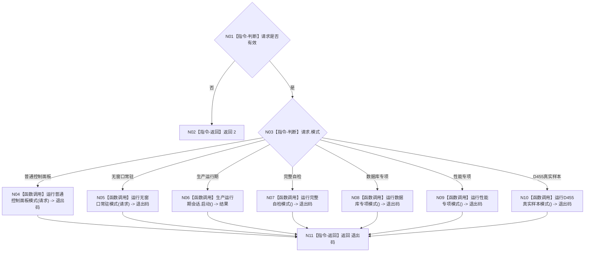

# MAIN-CLEANUP 运行应用施工流程图

更新时间：2026-07-26

```text
根函数：运行应用
归属：海中鱼巣/启动.应用入口.ixx
完整签名：int 运行应用(const 应用启动请求& 请求)
参数：请求，只读，调用期有效且必须已通过解析
返回：模式函数退出码
```


```mermaid
flowchart TD
    N01{"N01【指令-判断】请求是否有效"} -- "否" --> N02["N02【指令-返回】返回 2"]
    N01 -- "是" --> N03{"N03【指令-判断】请求.模式"}
    N03 -- "普通控制面板" --> N04["N04【函数调用】运行普通控制面板模式(请求) -> 退出码"]
    N03 -- "无窗口常驻" --> N05["N05【函数调用】运行无窗口常驻模式(请求) -> 退出码"]
    N03 -- "生产运行期" --> N06["N06【函数调用】生产运行期会话.启动() -> 结果"]
    N03 -- "完整自检" --> N07["N07【函数调用】运行完整自检模式() -> 退出码"]
    N03 -- "数据库专项" --> N08["N08【函数调用】运行数据库专项模式() -> 退出码"]
    N03 -- "性能专项" --> N09["N09【函数调用】运行性能专项模式() -> 退出码"]
    N03 -- "D455真实样本" --> N10["N10【函数调用】运行D455真实样本模式() -> 退出码"]
    N04 --> N11["N11【指令-返回】返回 退出码"]
    N05 --> N11
    N06 --> N11
    N07 --> N11
    N08 --> N11
    N09 --> N11
    N10 --> N11
```
