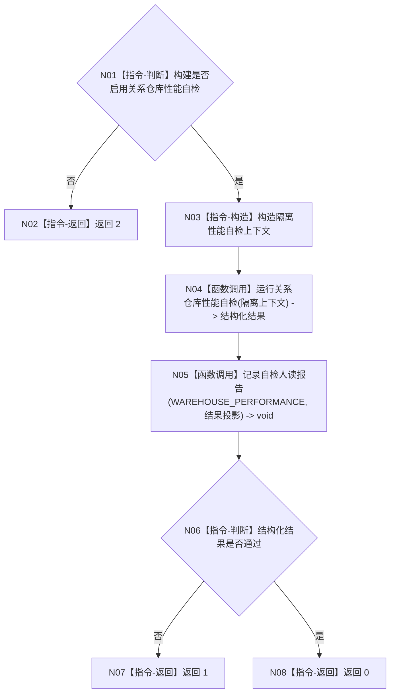

# MAIN-CLEANUP 运行性能专项模式施工流程图

更新时间：2026-07-26

```text
根函数：运行性能专项模式
归属：海中鱼巣/自检.模式入口.ixx
完整签名：int 运行性能专项模式()
参数：无
返回：0 专项通过；1 专项失败；2 构建不支持
```


```mermaid
flowchart TD
    N01{"N01【指令-判断】构建是否启用关系仓库性能自检"} -- "否" --> N02["N02【指令-返回】返回 2"]
    N01 -- "是" --> N03["N03【指令-构造】构造隔离性能自检上下文"]
    N03 --> N04["N04【函数调用】运行关系仓库性能自检(隔离上下文) -> 结构化结果"]
    N04 --> N05["N05【函数调用】记录自检人读报告(WAREHOUSE_PERFORMANCE, 结果投影) -> void"]
    N05 --> N06{"N06【指令-判断】结构化结果是否通过"}
    N06 -- "否" --> N07["N07【指令-返回】返回 1"]
    N06 -- "是" --> N08["N08【指令-返回】返回 0"]
```

日志宏开关不改变计时、阈值比较、结果或退出码。
