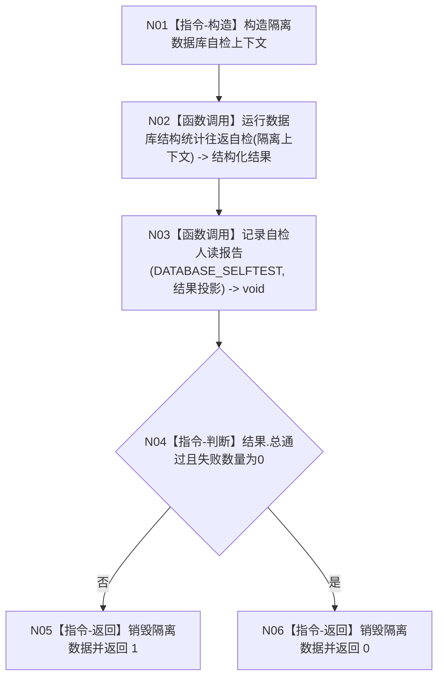

# MAIN-CLEANUP 运行数据库专项模式施工流程图

更新时间：2026-07-26

```text
根函数：运行数据库专项模式
归属：海中鱼巣/自检.模式入口.ixx
完整签名：int 运行数据库专项模式()
参数：无
返回：0 专项通过；1 专项失败
```


```mermaid
flowchart TD
    N01["N01【指令-构造】构造隔离数据库自检上下文"] --> N02["N02【函数调用】运行数据库结构统计往返自检(隔离上下文) -> 结构化结果"]
    N02 --> N03["N03【函数调用】记录自检人读报告(DATABASE_SELFTEST, 结果投影) -> void"]
    N03 --> N04{"N04【指令-判断】结果.总通过且失败数量为0"}
    N04 -- "否" --> N05["N05【指令-返回】销毁隔离数据并返回 1"]
    N04 -- "是" --> N06["N06【指令-返回】销毁隔离数据并返回 0"]
```

数据库材料不进入生产仓库；日志写入结果不参与 N04。
