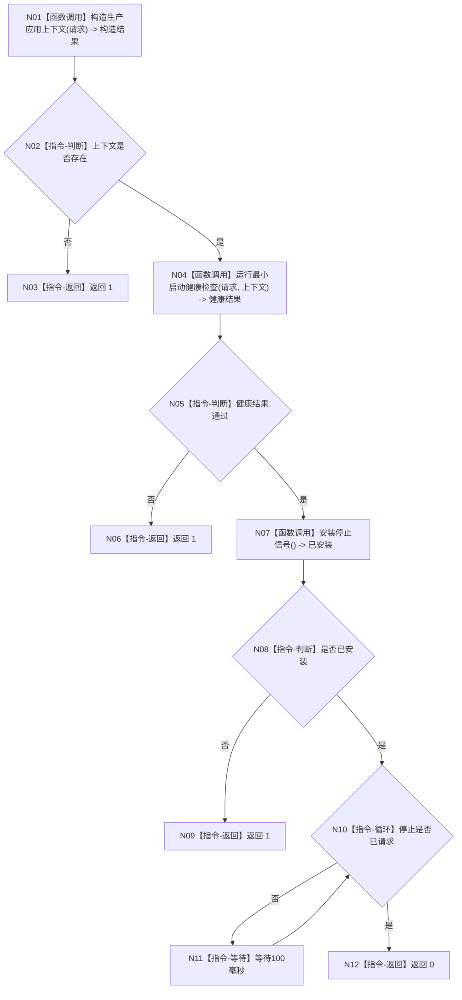

# MAIN-CLEANUP 运行无窗口常驻模式施工流程图

更新时间：2026-07-26

```text
根函数：运行无窗口常驻模式
归属：海中鱼巣/启动.应用入口.ixx
完整签名：int 运行无窗口常驻模式(const 应用启动请求& 请求)
参数：请求，只读，调用期有效
返回：0 正常停止；1 启动失败；2 模式拒绝
```


```mermaid
flowchart TD
    N01["N01【函数调用】构造生产应用上下文(请求) -> 构造结果"] --> N02{"N02【指令-判断】上下文是否存在"}
    N02 -- "否" --> N03["N03【指令-返回】返回 1"]
    N02 -- "是" --> N04["N04【函数调用】运行最小启动健康检查(请求, 上下文) -> 健康结果"]
    N04 --> N05{"N05【指令-判断】健康结果.通过"}
    N05 -- "否" --> N06["N06【指令-返回】返回 1"]
    N05 -- "是" --> N07["N07【函数调用】安装停止信号() -> 已安装"]
    N07 --> N08{"N08【指令-判断】是否已安装"}
    N08 -- "否" --> N09["N09【指令-返回】返回 1"]
    N08 -- "是" --> N10{"N10【指令-循环】停止是否已请求"}
    N10 -- "否" --> N11["N11【指令-等待】等待100毫秒"]
    N11 --> N10
    N10 -- "是" --> N12["N12【指令-返回】返回 0"]
```

调用图中不存在完整自检、数据库写入或专项自检。
