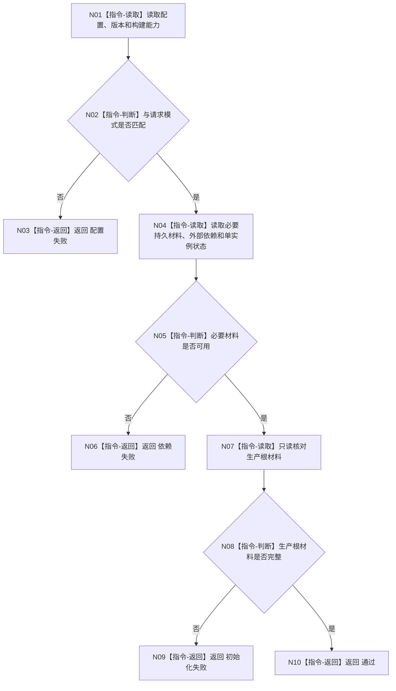

# MAIN-CLEANUP 运行最小启动健康检查施工流程图

更新时间：2026-07-26

```text
根函数：运行最小启动健康检查
归属：海中鱼巣/启动.应用入口.ixx
完整签名：启动健康检查结果 运行最小启动健康检查(const 应用启动请求& 请求, const 应用上下文& 上下文)
参数：请求与上下文均只读、调用期有效
返回：通过标志和失败编号组
```



禁止创建测试数据、运行正负例矩阵、压力测试、数据库自检或 D455 样本。
