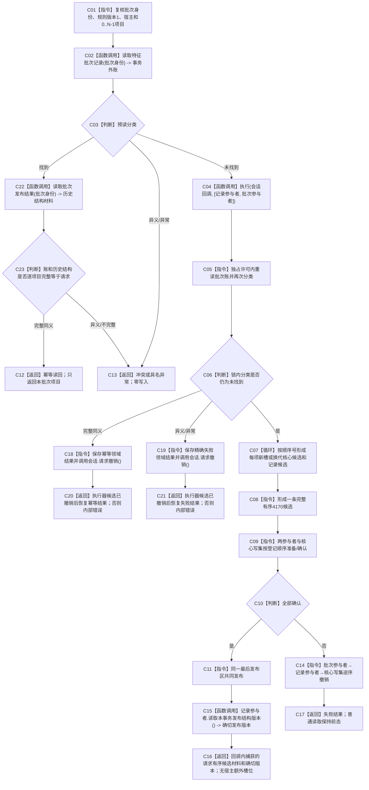

# NT-P2A 4170 批次发布业务流程图

更新时间：2026-07-29

## 依据与身份

正式目标业务流程图。依据：2100 v0.6、4040、4050、4110 v0.5、4170 现行版。

业务闭环：以一个非零批次身份和规则版本 1，把连续有序的初始 / 换代混合项目、所有核心结构候选、全部类型化记录候选和一条独立 4170 记录在同一事务原子发布。

## 流程图

## 业务节点—能力—函数映射

| 节点 | 所需能力 | 复用 / 新建 | 目标函数组 |
| --- | --- | --- | --- |
| C01—C03、C22—C23 | 4170 账预读、历史重建与完整同义 | 新建本域侧账；复用规范语义 | F-W104、F-W110、F-W113 |
| C04—C11 | 多参与者事务 | 复用核心执行器；新建记录 / 批次参与者 | F-W104—F-W108 |
| C07 | 初始 / 换代会话内候选 | 组合 F-W101/F-W102 的会话内算法，不启动子事务 | F-W104 |
| C15—C16 | 真实提交确切候选材料与记录仓版本 | 新建参与者回显 | F-A110、F-W104 |
| C18—C21 | 锁内竞争分类和显式撤销 | 复用核心请求撤销；新建领域结果恢复 | F-W104、F-W113 |

## 关键边界

- 一批次不能逐项提交，也不能先发布核心结构后补写 4170。
- 4170 不复制原始值；通过新值句柄回读类型化记录。
- 同键同义需同时证明账和全部结构；同键异义、顺序变化、来源变化或写前证据变化零写冲突。
- 锁内同键判断使用当前会话、关系审计、类型化记录访问器和批次账完成，不调用会再次取得结构读取许可的 F-W110；执行器撤销返回后才允许用 F-W110 形成幂等历史材料。
- 真实提交禁止事后调用 F-W110；返回回调内确切候选材料和 F-A110 本事务版本。
