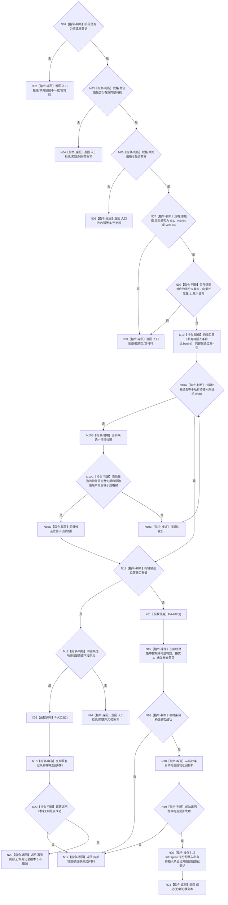

# F-A101 登记特征值类型化记录候选

根函数：`特征值类型化记录候选结果 特征值类型化记录事务参与者::登记记录候选(const 特征值类型化记录规格& 规格)`

归属：`海中鱼巣.领域.参与者.特征值类型化记录` / `海中鱼巣/领域/参与者.特征值类型化记录.ixx`；待新增；输入借用至返回，参与者复制自有候选；返回强类型值。

节点合同：N10 只读参与者私有列表；N13/N18 在任何状态修改前构造返回材料；N20 是本函数唯一候选状态写入且只使用无分配 `list::splice`。所有非成功结果材料为空；同键同义不追加，不能返回未定义的“已登记”状态。
