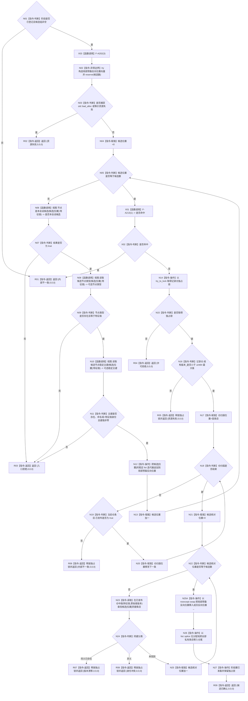

# F-A102 准备特征值类型化记录提交

根函数：`节点直接身份结构写入结果 特征值类型化记录事务参与者::准备提交(const 节点直接身份结构提交准备只读视图& 视图)`

归属：记录参与者模块；待新增；视图仅调用期借用；结果值式。

节点合同：N06/N08/N10 对每个候选逐项绑定当前真实准备视图的三个入口，不存在合成读取函数。本版本所有新记录只绑定同一会话新值候选；已发布值的幂等请求在进入执行器或回调第一写前收口。准备阶段不得返回 `已提交/幂等读回`；锁内同义只表示写前事实推进并返回核心 `版本漂移`。唯一分配点 N02 在取得仓锁前完成；N12 只改局部预备向量。所有视图和仓校验通过后，N25A/N26/N27 依次只做 noexcept swap、无分配 splice 和阶段赋值；因此任一较早失败保持成员反向位置、私有 list、仓和阶段的调用前状态。
