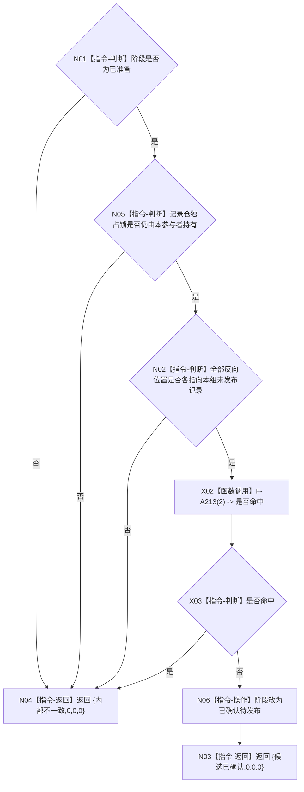

# F-A103 确认特征值类型化记录待发布

根函数：`节点直接身份结构写入结果 特征值类型化记录事务参与者::确认待发布()`

归属：记录参与者模块；待新增；无参数；返回值式阶段结果。

```mermaid
flowchart TD
 N01{"N01【指令-判断】阶段是否为已准备"} -- 否 --> N04["N04【指令-返回】返回 {内部不一致,0,0,0}"]
 N01 -- 是 --> N05{"N05【指令-判断】记录仓独占锁是否仍由本参与者持有"} -- 否 --> N04
 N05 -- 是 --> N02{"N02【指令-判断】全部反向位置是否各指向本组未发布记录"}
 N02 -- 否 --> N04["N04【指令-返回】返回 {内部不一致,0,0,0}"]
 N02 -- 是 --> X02["X02【函数调用】F-A213(2) -> 是否命中"]
 X02 --> X03{"X03【指令-判断】是否命中"}
 X03 -- 是 --> N04
 X03 -- 否 --> N06["N06【指令-操作】阶段改为已确认待发布"]
 N06 --> N03["N03【指令-返回】返回 {候选已确认,0,0,0}"]
```

节点合同：不发布、不释放锁、不分配；幂等候选保持可撤销。
