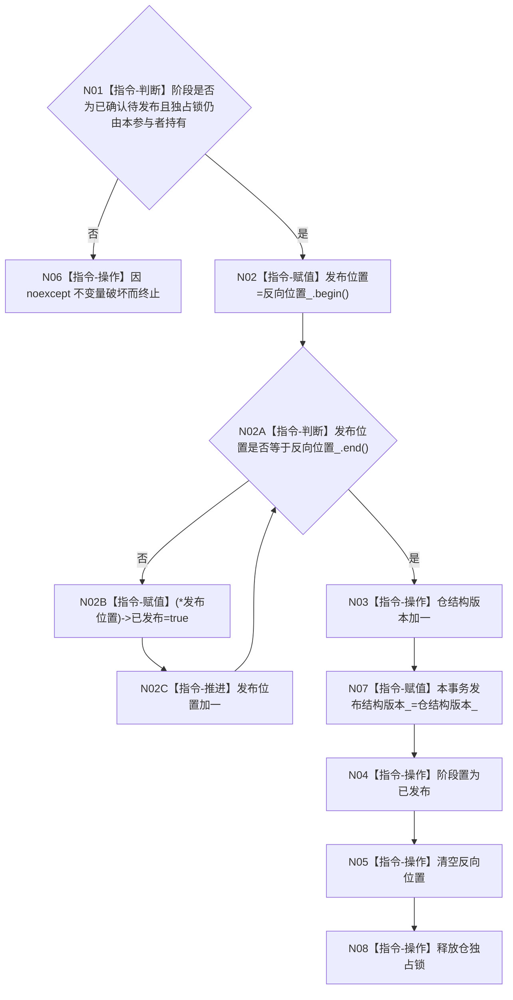

# F-A104 完成发布特征值类型化记录

根函数：`void 特征值类型化记录事务参与者::完成发布() noexcept`

归属：记录参与者模块；待新增；无参数；无返回。

```mermaid
flowchart TD
 N01{"N01【指令-判断】阶段是否为已确认待发布且独占锁仍由本参与者持有"} -- 否 --> N06["N06【指令-操作】因 noexcept 不变量破坏而终止"]
 N01 -- 是 --> N02["N02【指令-赋值】发布位置=反向位置_.begin()"]
 N02 --> N02A{"N02A【指令-判断】发布位置是否等于反向位置_.end()"}
 N02A -- 否 --> N02B["N02B【指令-赋值】(*发布位置)->已发布=true"]
 N02B --> N02C["N02C【指令-推进】发布位置加一"]
 N02C --> N02A
 N02A -- 是 --> N03["N03【指令-操作】仓结构版本加一"]
 N03 --> N07["N07【指令-赋值】本事务发布结构版本_=仓结构版本_"]
 N07 --> N04["N04【指令-操作】阶段置为已发布"]
 N04 --> N05["N05【指令-操作】清空反向位置"]
 N05 --> N08["N08【指令-操作】释放仓独占锁"]
```

节点合同：`noexcept` 区域禁止分配、日志、外部调用和可失败操作；版本溢出已在 F-A102 前置拒绝。N07 是 F-A110 的唯一来源；不变量破坏只能终止，不能返回假成功。
