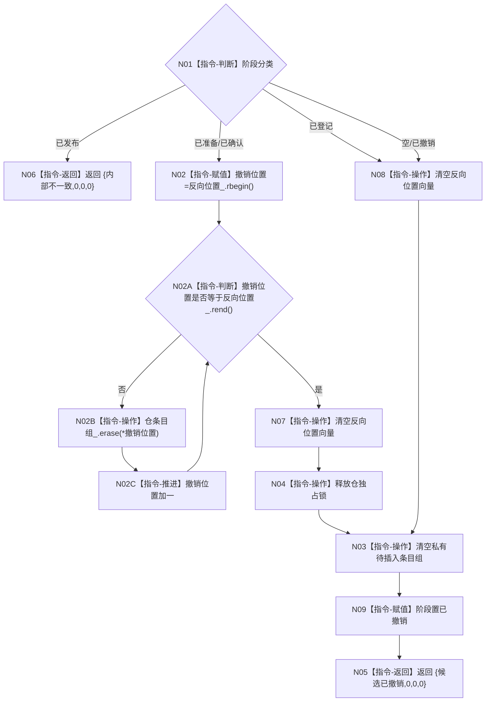

# F-A105 完成撤销特征值类型化记录

根函数：`节点直接身份结构写入结果 特征值类型化记录事务参与者::完成撤销()`

归属：记录参与者模块；待新增；无参数；返回值式阶段结果。

节点合同：空参与者撤销是成功幂等撤销，保证回调在登记候选前失败时执行器仍可逆序收口；已发布后调用为内部不一致。无论准备失败停在空、已登记、已准备或已确认，成功撤销后 `反向位置_` 与私有 list 都为空，不保留指向已销毁节点的迭代器。`list::erase`、vector clear 和锁释放均不得分配；若内部不变量破坏导致异常，执行器安全撤销包装为内部不一致并隔离事务域。
