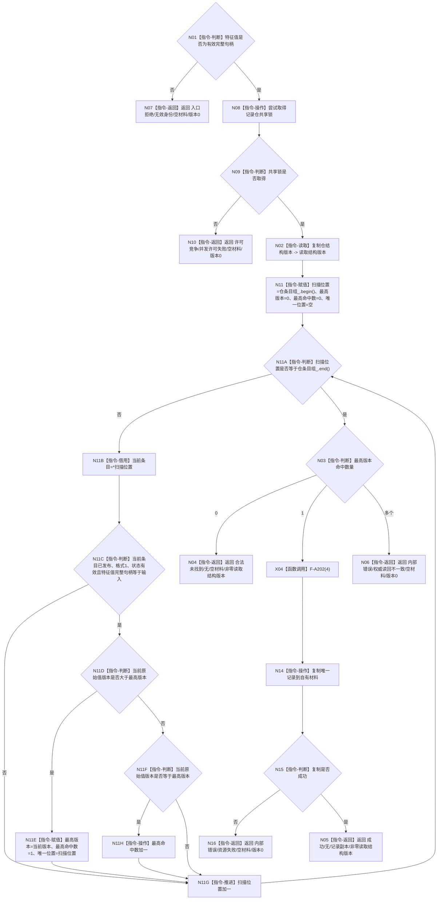

# F-A106 读取当前特征值类型化记录

根函数：`特征值类型化记录读取结果 特征值类型化记录只读访问器::读取当前记录(节点句柄 特征值) const`

归属：记录参与者模块；待新增；输入值式；返回自有记录副本和结构版本。

```mermaid
flowchart TD
 N01{"N01【指令-判断】特征值是否为有效完整句柄"} -- 否 --> N07["N07【指令-返回】返回 入口拒绝/无效身份/空材料/版本0"]
 N01 -- 是 --> N08["N08【指令-操作】尝试取得记录仓共享锁"]
 N08 --> N09{"N09【指令-判断】共享锁是否取得"} -- 否 --> N10["N10【指令-返回】返回 许可竞争/并发许可失败/空材料/版本0"]
 N09 -- 是 --> N02["N02【指令-读取】复制仓结构版本 -> 读取结构版本"]
 N02 --> N11["N11【指令-赋值】扫描位置=仓条目组_.begin()、最高版本=0、最高命中数=0、唯一位置=空"]
 N11 --> N11A{"N11A【指令-判断】扫描位置是否等于仓条目组_.end()"}
 N11A -- 否 --> N11B["N11B【指令-借用】当前条目=*扫描位置"]
 N11B --> N11C{"N11C【指令-判断】当前条目已发布、格式1、状态有效且特征值完整句柄等于输入"}
 N11C -- 否 --> N11G["N11G【指令-推进】扫描位置加一"]
 N11C -- 是 --> N11D{"N11D【指令-判断】当前原始值版本是否大于最高版本"}
 N11D -- 是 --> N11E["N11E【指令-赋值】最高版本=当前版本、最高命中数=1、唯一位置=扫描位置"]
 N11D -- 否 --> N11F{"N11F【指令-判断】当前原始值版本是否等于最高版本"}
 N11F -- 是 --> N11H["N11H【指令-操作】最高命中数加一"]
 N11F -- 否 --> N11G
 N11E --> N11G
 N11H --> N11G
 N11G --> N11A
 N11A -- 是 --> N03{"N03【指令-判断】最高版本命中数量"}
 N03 -- 0 --> N04["N04【指令-返回】返回 合法未找到/无/空材料/非零读取结构版本"]
 N03 -- 1 --> X04["X04【函数调用】F-A202(4)"]
 X04 --> N14["N14【指令-操作】复制唯一记录到自有材料"]
 N14 --> N15{"N15【指令-判断】复制是否成功"} -- 否 --> N16["N16【指令-返回】返回 内部错误/资源失败/空材料/版本0"]
 N15 -- 是 --> N05["N05【指令-返回】返回 成功/无/记录副本/非零读取结构版本"]
 N03 -- 多个 --> N06["N06【指令-返回】返回 内部错误/权威读回不一致/空材料/版本0"]
```

节点合同：候选和已失效 / 已删除版本不进入当前读取。
