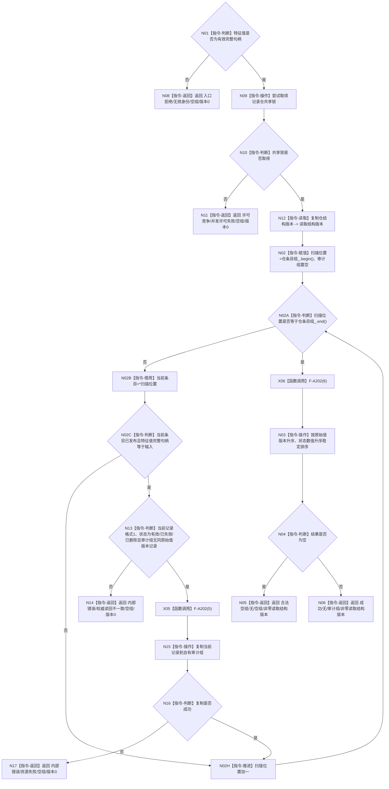

# F-A107 读取审计特征值类型化记录

根函数：`特征值类型化记录审计读取结果 特征值类型化记录只读访问器::读取审计记录(节点句柄 特征值) const`

归属：记录参与者模块；待新增；返回调用方自有的全部已发布版本组。

```mermaid
flowchart TD
 N01{"N01【指令-判断】特征值是否为有效完整句柄"} -- 否 --> N08["N08【指令-返回】返回 入口拒绝/无效身份/空组/版本0"]
 N01 -- 是 --> N09["N09【指令-操作】尝试取得记录仓共享锁"]
 N09 --> N10{"N10【指令-判断】共享锁是否取得"} -- 否 --> N11["N11【指令-返回】返回 许可竞争/并发许可失败/空组/版本0"]
 N10 -- 是 --> N12["N12【指令-读取】复制仓结构版本 -> 读取结构版本"]
 N12 --> N02["N02【指令-赋值】扫描位置=仓条目组_.begin()、审计组置空"]
 N02 --> N02A{"N02A【指令-判断】扫描位置是否等于仓条目组_.end()"}
 N02A -- 否 --> N02B["N02B【指令-借用】当前条目=*扫描位置"]
 N02B --> N02C{"N02C【指令-判断】当前条目已发布且特征值完整句柄等于输入"}
 N02C -- 否 --> N02H["N02H【指令-推进】扫描位置加一"]
 N02C -- 是 --> N13{"N13【指令-判断】当前记录格式1、状态为有效/已失效/已删除且审计组无同原始值版本记录"}
 N13 -- 否 --> N14["N14【指令-返回】返回 内部错误/权威读回不一致/空组/版本0"]
 N13 -- 是 --> X05["X05【函数调用】F-A202(5)"]
 X05 --> N15["N15【指令-操作】复制当前记录到自有审计组"]
 N15 --> N16{"N16【指令-判断】复制是否成功"} -- 否 --> N17["N17【指令-返回】返回 内部错误/资源失败/空组/版本0"]
 N16 -- 是 --> N02H
 N02H --> N02A
 N02A -- 是 --> X06["X06【函数调用】F-A202(6)"]
 X06 --> N03["N03【指令-操作】按原始值版本升序、状态数值升序稳定排序"]
 N03 --> N04{"N04【指令-判断】结果是否为空"}
 N04 -- 是 --> N05["N05【指令-返回】返回 合法空组/无/空组/非零读取结构版本"]
 N04 -- 否 --> N06["N06【指令-返回】返回 成功/无/审计组/非零读取结构版本"]
```

节点合同：有效、已失效和已删除版本均可进入审计；未知格式或重复版本为内部不一致。合法无审计固定返回 `合法空组`，不是 `合法未找到`。
