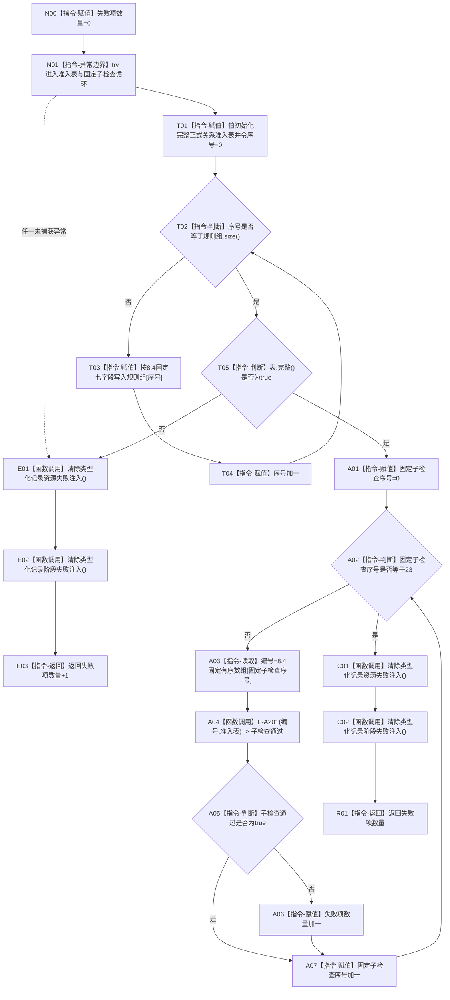

# F-A108 运行类型化记录专项源码自检单函数施工流程图

更新时间：2026-07-29

## 函数合同

```text
根函数：std::uint32_t 运行节点直接特征值类型化记录专项源码自检() noexcept
归属：海中鱼巣.领域.自检.节点直接特征值类型化记录 /
海中鱼巣/领域/自检.节点直接特征值类型化记录.ixx / export
参数：无。
返回：详细设计 8.4/8.5 的23个固定子检查失败数量；覆盖主用例 A01—A18；全部通过返回0。
被调非平凡函数：F-A201；见 `流程图/20260729_NT-P2A_F-A201_执行类型化记录专项子检查单函数施工流程图_v0.1.md`。
```

## 流程图



## 节点合同与边界

F-A108 只形成完整24项专项准入表并遍历固定23项数组；不构造仓、不发布候选、不自行展开 A01—A18。每个实际夹具、注入、目标调用、快照和比较全部由唯一 F-A201 一次一项完成。异常与正常返回都清除本专项全部 `thread_local` 状态。准入表只用于隔离夹具，不冒充生产装配；日志不参与调用、计数或返回。
